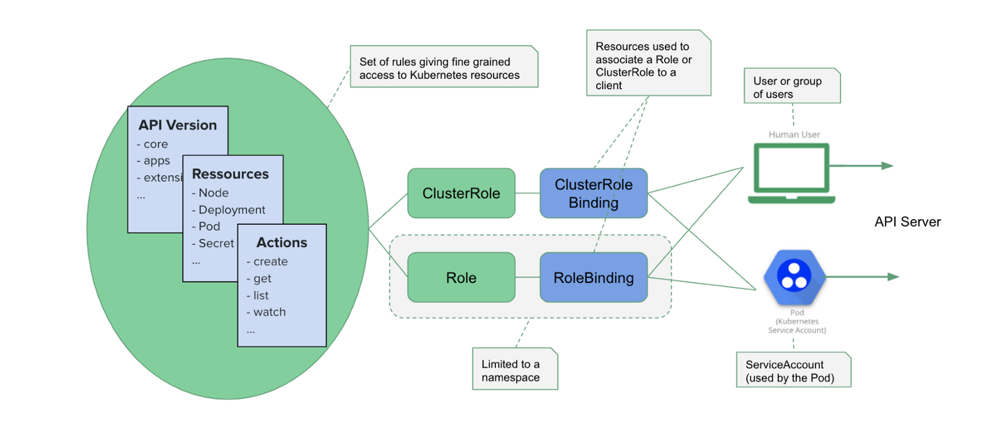

# Certified Kubernetes Administrator (CKA) 


Table of Contents
==================
* [Document History](#document-history)
* [Chapter 1: Core Concepts  (19%)](#chapter-1-core-concepts-19)
   * [Cluster Architecture](#cluster-architecture)
   * [API Primitives](#api-primitives)
   * [Services and Network](#services-and-network)     

* [Chapter 2: Install, Config and Validate (12%)](#chapter-2-install-config-and-validate-12)
   * [Binaries/Provision/Types](#binariesprovisiontypes)
   * [Installing Master and Nodes](#installing-master-and-nodes)
   * [Highly Available Cluster](#highly-available-cluster)
   * [Secure Cluster](#secure-cluster)
   * [End-to-End Tests](#end-to-end-tests)
   
* [Chapter 3: Cluster (11%)](#chapter-3-cluster-11)
   * [Cluster Upgrade Process](#cluster-upgrade-process)
   * [Operating System Upgrades](#operating-system-upgrades)
   * [Backup and Restore Methodologies](#backup-and-restore-methodologies)

* [Chapter 4: Networking (11%)](#chapter-4-networking-11)
   * [Node Networking Concepts](#node-networking-concepts) 
   * [Pod Networking Concepts](#pod-networking-concepts) 
   * [Service Networking Concepts](#service-networking-concepts) 
   * [Container Network Interface](#container-network-interface-cni) 
   * [Load Balancer Configure and Deploy](#load-balancer-configure-and-deploy) 
   * [Ingress Rules Configure](#ingress-rules-configure) 
   * [Cluster DNS Configure](#cluster-dns-configure) 
   
* [Chapter 5: Scheduling (5%)](#chapter-5-scheduling-5)
   * [Kubernetes Labels and Selectors to Schedule Pods](#kubernetes-labels-and-selectors-to-schedule-pods)
   * [Role of DaemonSets](#role-of-daemonsets)
   * [Resource Limits and Labels in Pods Scheduling](#resource-limits-and-labels-in-pods-scheduling)
   * [Multiple Schedulers to Run and Configure Pods](#multiple-schedulers-to-run-and-configure-pods)
   * [Manually Schedule a Pods](#manually-schedule-a-pods)
   * [Scheduler Events](#scheduler-events)
   * [Configure Kubernetes Scheduler](#configure-kubernetes-scheduler)
  
* [Chapter 6: Application Lifecycle (8%)](#chapter-6-application-lifecycle-8)
   * [Deploying an Application with Rolling Updates and Rollback](#deploying-an-application-with-rolling-updates-and-rollback)
   * [Configure Highly Available Application](#configure-highly-available-application)
   * [Scale Applications](#scale-applications)
   * [Manage Self-Healing Application](#manage-self-healing-application)
  
* [Chapter 7: Storage (7%)](#chapter-7-storage-7)
   * [Manage Persistent Volume](#manage-persistent-volume)
   * [Volume Access Modes](#volume-access-modes)
   * [Manage Persistent Volume Claims](#manage-persistent-volume-claims)
   * [Manage Storage Objects](#manage-storage-objects)
   * [Configure Application with Storage](#configure-application-with-storage)
  
* [Chapter 8: Security (12%)](#chapter-8-security-12)
   * [Security Primitives](#security-primitives)
   * [Configure Authentication and Authorization](#configure-authenticatation-and-authorization)
   * [Configure Network Policies](#configure-network-policies)
   * [Manage TLS Certificate for Cluster](#manage-tls-certificate-for-cluster)
   * [Image Security](#image-security)
   * [Persistent Key Value Stores](#persistent-key-value-stores)

* [Chapter 9: Log and Monitor (5%)](#chapter-9-log-and-monitor-5)
   * [Monitor All Cluster Component](#monitor-all-cluster-component)
   * [Monitor Applications](#monitor-applications)
   * [Cluster Component Logs](#cluster-component-logs)
   * [Manage Application Logs](#manage-application-logs)
   
* [Chapter 10: Troubleshooting (10%)](#chapter-10-troubleshooting-10)
   * [Application Failure](#application-failure)
   * [Control Plane Failure](#control-place-failure)
   * [Worker Node Failure](#worker-node-failure)
   * [Network Failure](#network-failure)
   
* [Appendix](#appendix)
   * [Kubernetes Primary Commands](#kubernetes-primary-commands)
   * [Kubectl Options](#kubectl-options)
   * [ETCD Server Commands](#etcd-server-commands)
   * [Firewall Related Commands](#firewall-related-commands)
   * [Kubectl Imperative Commands ](#kubectl-imperative-commands)
   * [Namespace](#namespace)
   * [Kubernetes Configuration Directory Architecture](#kubernetes-configuration-directory-architecture)

## Document History

```
Document History:
2020-05-01	V1 Mehedi Hasan  "Certified Kubernetes Administrator (CKA) Curriculum"
```

## Chapter 1: Core Concepts (19%) 
   ### Cluster Architecture
   In kubernetes cluster there are two main component
   ```bash
   1. Master Node
   2. Worker Node
   ```
  #### Master Node:  
  There are 4 basic component in Master Node on The Control Plane:  
  Components:  
  ```
  1. API Server
  2. Scheduler
  3. Controller Manager
  4. ETCD
  ```
  * **API Server**: API server is the communication hub for all cluster components. It exposes many kubernetes API.  
  * **Scheduler**: Assign application/pod to worker node. Auto detects which pod to assign to which node based on resources requirements, hardware constrains etc. Its doesn't pod on worker node itself.  
  * **Controller Manager**: Maintaining the cluster. Handles node failures, replicating components, maintaining correct amount of POD.  
  * **ETCD**: Data store that stores cluster information.  
  
  Depending on Setup you can see configuration of each component in directory in following way. You will find all Control Plane component it there 
  1. Kubeadm Setup:  ```/etc/kubernetes/manifests/```  
  2. Hardway Setup:  ```/etc/systemd/system```
  
  ```
  -- Kubeadm 
  $ cat /etc/kubernetes/manifests/api-server.yaml
  $ cat /etc/kubernetes/manifests/etcd-server.yaml
  $ cat /etc/kubernetes/manifests/kube-controller-manager.yaml
  $ cat /etc/kubernetes/manifests/scheduler-manager.yaml
  
  -- Hardway 
  $ cat /etc/systemd/system/api-server.service
  $ cat /etc/systemd/system/etcd-server.service
  $ cat /etc/systemd/system/kube-controller-manager.service
  $ cat /etc/systemd/system/scheduler-manager.service

  -- Using process
  $ ps -ef | grep api-server
  $ ps -ef | grep etcd-server
  $ ps -ef | grep kube-contoller-manager
  $ ps -ef | grep scheduler-manager
  ```
  
  
  #### Worker Node:
  Components:
  ```
  1. Kubelet
  2. Kube-proxy
  3. Container Runtime
  ```
  
  * **Kubelet**:  
  Run and manages the containers on the nodes and communicate to API Server. 
  ```
  * Kubeadm does not install kubelet automatically. It need to download manually
  ```
  * **Kube-proxy**: Load balance traffic between application components.  
  ```
  * It creates iptable rules in each node to forward traffic to the IP of the service. Example: DaemonSet  
  ```
  * **Container Runtime**: The programs that run containers
  ```
  1. Docker
  2. rkt
  3. containerd
  ```
  
  #### Command References
  ```bash
  -- API Call
  $ kubectl get --raw /apis/metrics.k8s.io/

  -- Cluster Information
  $ kubectl config
  $ kubectl cluster-info
  $ kubectl get componentstatuses
  ```
  
  #### References and Further Study
  * https://kubernetes.io/docs/concepts/overview/components/
  * https://wiki.aquasec.com/display/containers/Kubernetes+Architecture+101
  
 ### API Primitives
  > Kubernetes API to read and write Kubernetes resource objects via a Kubernetes API endpoint.
   
  #### Resources Categories  
  There are 5 basic types of resources provided by kubernetes API 
  1. **Workloads** are objects you use to manage and run your containers on the cluster.
  2. **Discovery & LB** resources are objects you use to "stitch" your workloads together into an externally accessible, load-balanced Service.
  3. **Config & Storage** resources are objects you use to inject initialization data into your applications, and to persist data that is external to your container.
  4. **Cluster** resources objects define how the cluster itself is configured; these are typically used only by cluster operators.
  5. **Metadata** resources are objects you use to configure the behavior of other resources within the cluster, such as HorizontalPodAutoscaler for scaling workloads.
    
  #### Resources Objects 
  Resource objects typically have 3 components:
   
  1. **Resource ObjectMeta**: This is metadata about the resource, such as its name, type, api version, annotations, and labels. This contains fields that maybe updated both by the end user and the system (e.g. annotations).
  2. **ResourceSpec**: This is defined by the user and describes the desired state of system. Fill this in when creating or updating an object.
  3. **ResourceStatus**: This is filled in by the server and reports the current state of the system. In most cases, users don't need to change this.
   
  #### Resources Operations
  Most resources provide the following Operations:

  1. **Create**  
  Create operations will create the resource in the storage backend. After a resource is create the system will apply the desired state.
    
  2. **Update**  
  Updates come in 2 forms: Replace and Patch:
    
     **Replace**: Replacing a resource object will update the resource by replacing the existing spec with the provided one. For read-then-write operations this is safe because an optimistic lock failure will occur if the resource was modified between the read and write. Note: The ResourceStatus will be ignored by the system and will not be updated. To update the status, one must invoke the specific status update operation.
        Note: Replacing a resource object may not result immediately in changes being propagated to downstream objects. For instance replacing a ConfigMap or Secret resource will not result in all Pods seeing the changes unless the Pods are restarted out of band.  
        
     **Patch**: Patch will apply a change to a specific field. How the change is merged is defined per field. Lists may either be replaced or merged. Merging lists will not preserve ordering.
        Patches will never cause optimistic locking failures, and the last write will win. Patches are recommended when the full state is not read before an update, or when failing on optimistic locking is undesirable. When patching complex types, arrays and maps, how the patch is applied is defined on a per-field basis and may either replace the field's current value, or merge the contents into the current value.
    
  3. **Read**
  Reads come in 3 forms: Get, List and Watch:
    
     **Get**: Get will retrieve a specific resource object by name.  
     **List**: List will retrieve all resource objects of a specific type within a namespace, and the results can be restricted to resources matching a selector query.  
     **List All Namespaces**: Like List but retrieves resources across all namespaces.    
     **Watch**: Watch will stream results for an object(s) as it is updated. Similar to a callback, watch is used to respond to resource changes.  
        
  4. **Delete**  
  Delete will delete a resource. Depending on the specific resource, child objects may or may not be garbage collected by the server. See notes on specific resource objects for details.
    
  5. **Additional Operations**  
  Resources may define additional operations specific to that resource type.  
    
     **Rollback**: Rollback a PodTemplate to a previous version. Only available for some resource types.  
     **Read / Write Scale**: Read or Update the number of replicas for the given resource. Only available for some resource types.  
     **Read / Write Status**: Read or Update the Status for a resource object. The Status can only changed through these update operations.              
    
  #### Command References
  ```bash
    -- create a deployment from yaml file nginx.yaml
    $ kubectl create -f nginx.yaml

    -- Generate yaml from a pod
    $ kubectl get deployment nginx-deployemnt -o yaml > nginx.yaml  
  ```  
  #### References and Further Study
  * https://kubernetes.io/docs/concepts/overview/working-with-objects/kubernetes-objects/
  * https://kubernetes.io/docs/reference/generated/kubernetes-api/v1.16/#container-v1-core
   
  ### Services and Network
    > Understand Services and other network primitives
    
  #### Services
  
  #### Networking Primitives
  
  #### Kubernetes Command
  There are two ways to create resources in a Kubernetes cluster: the imperative and the declarative ones.  
  1. **Declarative**: The declarative approach is used to create resources from manifest files (usually in YAML) using the kubectl apply command. 
  This is the approach used in a production environment.  
  ```kubectl apply -f <object>.<yaml,json>```
  2. **Imperative**: The imperative way is used to manage resources using several distinct commands and do not requires any manifest files.  
  
  ```
  -- Create an NGINX Pod
  $ kubectl run --generator=run-pod/v1 nginx --image=nginx --dry-run -o yaml 
    
  -- Create a deployment
  $ kubectl create deployment --image=nginx nginx --dry-run -o yaml
  $ kubectl run --generator=deployment/v1beta1 nginx --image=nginx --dry-run --replicas=4 -o yaml
    
  -- Create a Service named redis-service of type ClusterIP to expose pod redis on port 6379
  $ kubectl expose pod redis --port=6379 --name redis-service --dry-run -o yaml
  $ kubectl create service clusterip redis --tcp=6379:6379 --dry-run -o yaml
  ```
  
  ##### Generator
  You can generate the following resources with a kubectl command,   
  ```kubectl create --dry-run -o yaml```
  ```
clusterrole         Create a ClusterRole.
  clusterrolebinding  Create a ClusterRoleBinding for a particular ClusterRole.
  configmap           Create a configmap from a local file, directory or literal value.
  cronjob             Create a cronjob with the specified name.
  deployment          Create a deployment with the specified name.
  job                 Create a job with the specified name.
  namespace           Create a namespace with the specified name.
  poddisruptionbudget Create a pod disruption budget with the specified name.
  priorityclass       Create a priorityclass with the specified name.
  quota               Create a quota with the specified name.
  role                Create a role with single rule.
  rolebinding         Create a RoleBinding for a particular Role or ClusterRole.
  secret              Create a secret using specified subcommand.
  service             Create a service using specified subcommand.
  serviceaccount      Create a service account with the specified name.
```
  
  #### Command References
  ```bash
    # create a deployment from yaml file nginx.yaml
    $ kubectl create -f nginx.yaml
    # Generate yaml from a pod
    $ kubectl get deployment nginx-deployemnt -o yaml > nginx.yaml  
  ```  

  #### References and Further Study
  * https://kubernetes.io/docs/reference/kubectl/cheatsheet/
  * https://kubernetes.io/docs/concepts/services-networking/service/
  * https://kubernetes.io/docs/reference/kubectl/conventions/
  
  
## Chapter 2: Install, Config and Validate (12%)
   ### Binaries/Provision/Types
   #### Command References
   ```bash
   -- view addresses of master and services
   $ kubectl cluster-info

   -- show kubeconfig settings
   $ kubectl config view

   -- show all nodes details
   $ kubectl describe nodes

   -- show all pod details
   $ kubectl describe pods

   -- show all services
   $ kubectl get services --all-namespaces

   -- show all resources
   $ kubectl api-resources -o wide
   ```  

   #### References and Further Study
   * https://kubernetes.io/docs/home/
  
   ### Installing Master and Nodes
   Kubernetes cluster can install in two ways
   * Kubernetes Hard Way
   * Kubeadm Way

   #### References and Further Study
   * https://github.com/mmumshad/kubernetes-the-hard-way
   * https://github.com/gitmehedi/cloudtuts/blob/develop/kubernetes/kubernetes_installation.md
   
   ### Highly Available Cluster
   #### References and Further Study
   * https://kubernetes.io/docs/setup/production-environment/tools/kubeadm/high-availability/
   
   ### Secure Cluster
   #### Command References
   ```bash
   -- view the kubeconfig
   $ cat .kube/config | more

   -- view service account token
   $ kubectl get secrets
   ```  
   
   #### References and Further Study
   * https://kubernetes.io/docs/reference/access-authn-authz/controlling-access/
   
   ### End-to-End Tests
   For end-to-end test verify those checklist
   * Deployments can run
   * Pods can run
   * Pod can directly access
   * Logs can be collected
   * Command run from Pod
   * Services can provide access
   * Nodes are healthy
   * Pods are healthy
   
   #### Command References
   ```
   -- run a simple nginx deployements
   $ kubectl run nginx --image=nginx

   -- view current deployements
   $ kubectl get deploy

   -- lists the pods in the cluster
   $ kubectl get pods

   -- forward port 80 to 8081 on pod
   $ kubectl port-forward nginx 8081:80

   -- get a response from nginx pod
   $ curl --head http://127.0.0.1:8081

   -- get pods logs
   $ kubectl logs nginx

   -- run a command on the pod nginx
   $ kubectl exec -t nginx -- nginx -v 

   -- create a service using our deployment
   $ kubectl expose deploy nginx --port 80 --type NodePort

   -- list the services in the cluster
   $ kubectl get services

   -- get a response from a service
   $ curl -I localhost:<node_port>

   -- list node status
   $ kubectl get nodes

   -- get details info about node
   $ kubectl describe nodes

   -- get details info about pods
   $ kubectl describe pods


   ```
   #### References and Further Study
   * https://github.com/gitmehedi/cloudtuts/blob/develop/kubernetes/kubernetes_installation.md
   
    
## Chapter 3: Cluster (11%)
   ### Cluster Upgrade Process
   kubeadm allows to upgrade cluster components in proper order from one version to another once at a time. 
   
   ```
    -- Allows 1 version at a time
    => 1.12.0 to 1.13.0
    => 1.16.0 to 1.17.0
    
    -- Not Allow
    => 1.12.0 1.16.0
   ```
   #### Upgrade Process
   Follow steps to upgrade lower version to upper version  
   
   ##### Step 1: Get the version of API Server
   ```bash
   $ kubectl version --short
   Client Version: v1.18.0
   Server Version: v1.18.0
   ```
   ##### Step 2: Get the version of kubelet
   ```
   $ kubectl describe nodes
   Kubelet Version:            v1.18.0
   Kube-Proxy Version:         v1.18.0
   ```
   ##### Step 3: Get the version of api-server, kube-apiserver, kube-scheduler, kube-controller-manager
   ```
   $ kubectl get pod -n kube-system
    NAME                                                READY   STATUS    RESTARTS   AGE
    coredns-66bff467f8-8wr6w                            1/1     Running   6          25d
    etcd-master                                         1/1     Running   7          25d
    kube-apiserver-master                               1/1     Running   7          25d
    kube-controller-manager-master                      1/1     Running   7          25d
    kube-flannel-ds-amd64-qzxkh                         1/1     Running   9          25d
    kube-proxy-2khkk                                    1/1     Running   6          25d
    kube-scheduler-master                               1/1     Running   7          25d

    -- Get etcd version
    $ kubectl describe pod etcd-master  -n kube-system | grep Image:
    Image:         k8s.gcr.io/etcd:3.4.3-0
    
    -- Get kube-apiserver version
    $ kubectl describe pod kube-apiserver-master -n kube-system | grep Image:
    Image:         k8s.gcr.io/kube-apiserver:v1.18.0
    
    -- Get kube-controller-manager version
    $ kubectl describe pod kube-controller-manager-master -n kube-system | grep Image:
    Image:         k8s.gcr.io/kube-controller-manager:v1.18.0
    
    -- Get kube-scheduler version
    $ kubectl describe pod kube-scheduler-master -n kube-system | grep Image:
    Image:         k8s.gcr.io/kube-scheduler:v1.18.0
    
   ```

   ##### Step 4: Upgrade kubeadm required latest version (1.18.2) and Install kubeadm 
   ```
   -- unhold kubeadm version if already in hold status
   $ sudo apt-mark unhold kubeadm
   Canceled hold on kubeadm
   
   -- install kubeadm version 1.18.2
   $ sudo apt-get install -y kubeadm=1.18.2-00

   -- hold kubeadm version after install kubeadm
   $ sudo apt-mark hold kubeadm

   -- get latest kubeadm version
   $ kubeadm version
   kubeadm version: &version.Info{Major:"1", Minor:"18", GitVersion:"v1.18.2", GitCommit:"9e991415386e4cf155a24b1da15becaa390438d8", GitTreeState:"clean", BuildDate:"2020-03-25T14:56:30Z", GoVersion:"go1.13.8", Compiler:"gc", Platform:"linux/amd64"}
   ```

   ##### Step 5: Plan controller component upgrade plan before final execution
   ```
   $ sudo kubeadm upgrade plan
    
    Upgrade to the latest version in the v1.18 series:
    
    COMPONENT            CURRENT   AVAILABLE
    API Server           v1.18.0   v1.18.2
    Controller Manager   v1.18.0   v1.18.2
    Scheduler            v1.18.0   v1.18.2
    Kube Proxy           v1.18.0   v1.18.2
    CoreDNS              1.6.7     1.6.7
    Etcd                 3.4.3     3.4.3-0
    You can now apply the upgrade by executing the following command:

        kubeadm upgrade apply v1.18.2

   ```

   ##### Step 6: Upgrade the controller component
   ```
   -- upgrade kubeadm to latest version
   $ sudo kubeadm upgrade apply v1.18.2
   $ kubect get nodes
    NAME     STATUS   ROLES    AGE   VERSION
    master   Ready    master   25d   v1.18.0
    worker   Ready    <none>   25d   v1.18.0

    -- get api server version
   $ kubectl version --short
    Client Version: v1.18.0
    Server Version: v1.18.2
   ```

   ##### Step 7: Upgrade the kubelet version (1.18.2) and Install
   ```
   -- unhold kubelet version  
   $ sudo apt-mark unhold kubectl
   Canceled hold on kubelctl

   -- upgrade kubectl
   $ sudo apt-get install -y kubectl=1.18.2-00
   
   -- Get the version
   $ kubectl version --short
   Client Version: v1.18.2
   Server Version: v1.18.2
   
   -- hole version of kubelet
   $ sudo apt-mark hold kubelet
   kubelet set on hold.
   ```

   #### References and Further Study
   * https://kubernetes.io/docs/reference/setup-tools/kubeadm/kubeadm-upgrade/
   * https://github.com/kubernetes/community/blob/master/contributors/devel/sig-architecture/api-conventions.md
   * https://kubernetes.io/docs/concepts/overview/kubernetes-api/
   * https://github.com/kubernetes/community/blob/master/contributors/devel/sig-architecture/api_changes.md
   
   ### Operating System Upgrades
   
   #### Terminology:  
   In operating system upgrade some terms are very important
   
   1. Drain: When a node drain, Pod are terminated form the node and Pod are recreated on another node where requirement match.
    Also node marked as unscheduled, meaning no Pod can be schedule on this node until you specify Scheduled or uncordon.
    Using it Pod can safe on other node.  
   2. Cordon: Marked node as unschedule able.  
   3. Uncordon: Marked node as scheduleable so that Pod can schedule on this node.
   
   #### System Upgrade Process: 
   ##### Step 1: Evict the Pod from node using drain and take node down.
   Get details of pods which is running on which nodes.
   ```
   -- get pod details
   $ kubectl get pods -o wide
   ```

   Node mark as drain so that pod evict from specified node.
   ```
   -- mark node as drain
   $ kubectl drain [node_name] --ignore-daemonsets
   ```
 
   Watch node changes status
   ```
   -- watch node changes in real time
   $ kubectl get nodes -w
   ```
 

   ##### Step 2: Maintains the node.
   Maintains on node as required.
   Remove a node from the cluster if node is not required
   ```
   $ kubectl delete node [node_name]
   ```  
   
   ##### Step 3: After maintenance continue scheduling using uncordon the node.
   Schedule pods to the node after maintenance is complete:
   ```
   -- uncordon node01
   $ kubectl uncordon node01
   ```  
   **Add New Node**  
   Prepare a new node
   
   Generate a new token:  
   ```
   -- generate token
   $ sudo kubeadm token generate
   ```  
    
   List the tokens:  
   ```
   $ sudo kubeadm token list
   ```  
    
   Print the kubeadm join command to join a node to the cluster:  
   ```
   $ sudo kubeadm token create [token_name] --ttl 2h --print-join-command 
   ```  
    
       
   #### Command References
   ```bash
    $ kubectl drain [node_name]
    $ kubectl cordon [node_name]
    $ kubectl delete [node_name]
    $ kubectl edit [node_name]
   ```  
   #### References and Further Study
   * https://kubernetes.io/docs/tasks/administer-cluster/cluster-management/#maintenance-on-a-node  
   
   
   ### Backup and Restore Methodologies
   #### ETCDCTL

   etcdctl is a command line client for etcd.  
   ETCD key-value database is deployed as a static pod on the master. Current version used is v3.

   To make use of ```etcdctl``` for tasks such as back up and restore, make sure that you set the ```ETCDCTL_API``` to 3.

   It can be done by exporting the variable ```ETCDCTL_API``` prior to using the ```etcdctl``` client. 
   
   ```
    -- can be done
    export ETCDCTL_API=3
   ```

   On the Master Node:

   To see all the options for a specific sub-command, make use of the -h or --help flag.  
   For example, if you want to take a snapshot of ```etcd```, use:  
   ```
   etcdctl snapshot save -h
   ```   
   and keep a note of the mandatory global options.

   Since ETCD database is TLS-Enabled, the following options are mandatory:
   ```
   --endpoints=[127.0.0.1:2379]    This is the default as ETCD is running on master node and exposed on localhost 2379.
   --cacert                        verify certificates of TLS-enabled secure servers using this CA bundle
   --cert                          identify secure client using this TLS certificate file
   --key                           identify secure client using this TLS key file
   ```

   Similarly use the help option for snapshot restore to see all available options for restoring the backup.

   ```
   etcdctl snapshot restore -h
   ```

   For a detailed explanation on how to make use of the ```etcdctl``` command line tool and work with the -h flags, check out the solution video for the Backup and Restore Lab.
   #### Backup ETCD
   
   Backup candidates using following ways
   ```
    1. Resource Configuration
    2. ETCD Cluster
   ```

   ##### Step 1. Resource Configuration
   Take all configuration from a cluster using  
   ```
   -- get all resourece from cluster
   $ kubectl get all --all-namespaces -o yaml > all_deploy_service.yaml
   ```  
   
   ##### Step 2. ETCD Cluster
   Take backup on specific location
   ```
    -- snapshot will save at /tmp/snapshot-pre-boot.db
    $ ETCDCTL_API=3 etcdctl --endpoints=https://[127.0.0.1]:2379 \
      --cacert=/etc/kubernetes/pki/etcd/ca.crt \
      --cert=/etc/kubernetes/pki/etcd/server.crt \
      --key=/etc/kubernetes/pki/etcd/server.key \
      snapshot save /tmp/snapshot-pre-boot.db
   ```
   
   See the status of snapshot
   ```
   $ ETCDCTL_API=3 etcdctl snapshot status /tmp/snapshot-pre-boot.db
    436037d5, 2612, 854, 2.3 MB
   ```
   
   #### Restore
   Restore ETCD Snapshot to a new directory
   ```
   ETCDCTL_API=3 etcdctl 
     --endpoints=https://[127.0.0.1]:2379 \
     --cacert=/etc/kubernetes/pki/etcd/ca.crt \
     --cert=/etc/kubernetes/pki/etcd/server.crt \
     --key=/etc/kubernetes/pki/etcd/server.key \
     --name=master \
     --data-dir /var/lib/etcd-from-backup \
     --initial-cluster=master=https://127.0.0.1:2380 \
     --initial-cluster-token etcd-cluster-1 \
     --initial-advertise-peer-urls=https://127.0.0.1:2380 \
     snapshot restore /tmp/snapshot-pre-boot.db
   ```

   Add new data directory inside etcd file ```/etc/kubernetes/manifests/etcd.yaml```
   ```
    -- add following lines under command
    $ vim /etc/kubernetes/manifests/etcd.yaml

    --data-dir=/var/lib/etcd-from-backup
    --initial-cluster-token=etcd-cluster-1

    volumeMounts:
        - mountPath: /var/lib/etcd-from-backup
          name: etcd-data
        - mountPath: /etc/kubernetes/pki/etcd
          name: etcd-certs
      hostNetwork: true
      priorityClassName: system-cluster-critical
      volumes:
      - hostPath:
          path: /var/lib/etcd-from-backup
          type: DirectoryOrCreate
        name: etcd-data
      - hostPath:
          path: /etc/kubernetes/pki/etcd
          type: DirectoryOrCreate
        name: etcd-certs
   ```

   #### Command References
   ```bash
    -- Get the version of etcd 
    $ kubectl logs etcd-master -n kube-system
    $ kubectl describe pod etcd-master -n kube-system
   ``` 

   #### References and Further Study
   * https://github.com/mmumshad/kubernetes-the-hard-way/blob/master/practice-questions-answers/cluster-maintenance/backup-etcd/etcd-backup-and-restore.md
   
## Chapter 4: Networking (11%)
   ### Network Pre-requisite
   
   #### Command References
   ```bash
    -- Manage and display the state of all network
interfaces
    $ ip link
    $ ip link set em1 down
    $ ip link set em1 mtu 9000
    $ ip link add veth-red type veth peer name veth-bridge

    -- Display IP Addresses and property information
    $ ip addr
    $ ip addr add 192.168.1.1/24 dev em1

    -- Display and alter the routing table
    $ ip route

    -- see all interface in a network
    $ ip arp

    -- Manage network namespace
    $ ip netns
    $ ip netns add blue
    $ ip netns exec red blue
   ``` 

   #### References and Further Study
   * [IP Command](https://access.redhat.com/sites/default/files/attachments/rh_ip_command_cheatsheet_1214_jcs_print.pdf)
  
   
   
   #### Network Namespace
   
   Create network namespaces  
   1. Create Network Namespace  
   ```
   -- create two network namespace red and blue
   $ ip netns add red
   $ ip netns add blue
   ```
   2. Create Bridge Network/Interface  
   ```
   -- create bridge network
   $ ip link add v-net-0 type bridge
   ```
   3. Create VETH Pairs (Pipe/Virtual Cable)  
   ```
   -- create ip network cable
   $ ip link add veth-red type veth peer name veth-red-br
   $ ip link add veth-blue type veth peer name veth-blue-br
   ```
   4. Attach vEth to Namespace  
   ```
   -- attach blue and red cable with namespace
   $ ip link set veth-red netns red
   $ ip link set veth-blue netns blue
   ```

   5. Attach Other vEth to Bridge  
   ```
   -- attach cable with bridge
   $ ip link set veth-red-br master v-net-0
   $ ip link set veth-blue-br master v-net-0
   ```

   6. Assign IP Address  
   ```
   -- set ip address with blue and red namepsace
   $ ip -n red addr add 192.168.15.1 dev veth-red
   $ ip -n blue addr add 192.168.15.2 dev veth-blue
   ```

   7. Bring the Interface UP  
   ```
   -- bring namespce and bridge network up
   $ ip -n red link set veth-red up
   $ ip -n blue link set veth-blue up
   $ ip link set dev v-net-0 up
   ```
   8. Enable NAT-IP Masquerade  
   ```
   -- enable nat-ip masquerade
   $ iptable -t nat -A POSTROUTING -s 192.168.15.0/24 -j MASQUERADE
   ```
   
   ### Node Networking Concepts
   For node networking  
   * Each node must have a Interface
   * Each node must have a MAC Address  
   
   #### Ports
   
   | Name                    | Ports       |
   |------------------------ | ----------- |
   | kube-apiserver          | 6443        |
   | kube-scheduler          | 10251       |
   | kube-controller-manager | 10252       |
   | etcd                    | 2379,2380   |
   | kubelet                 | 10250       |
   | worker-node             | 30000-32767 |
   
   
   #### References and Further Study
   * https://kubernetes.io/docs/concepts/cluster-administration/networking/
   
   ### Pod Networking Concepts
   #### Command References
   ```bash
    
   ``` 

   #### References and Further Study
   
   
   ### Service Networking Concepts
   To make a POD accessible create a service for that POD. Service is actually create a forwarding rule in each node  
   
   | IP Address     | Forward To    |
   | -------------  | ------------- |
   | 192.168.13.178 | 10.244.1.2    |
   
   
   ##### ClusterIP: 
   To make a POD accessible for all POD within the cluster create a service with type clusterIP.
   ##### NodePort:
   When a POD is needed to access by outside of the cluster then it's called nodePort.
   ##### LoadBalancer:
   When a POD is needed to access by outside of the cluster then it's called nodePort.
   
   Marjor Terms:  
   * Kube-proxy
   * iptables
   * ipvs
   
   #### Command References
   ```bash
    
   ``` 

   #### References and Further Study
   * https://kubernetes.io/docs/concepts/services-networking/service/#publishing-services-service-types
   
   
   ### Container Network Interface (CNI)
   #### Command References
   ```bash
    
   ``` 

   #### References and Further Study
   
   
   ### Load Balancer Configure and Deploy
   #### Command References
   ```bash
    
   ``` 

   #### References and Further Study
   
   
   ### Ingress Rules Configure
   Ingress is a layer 7 load balancer built-in with kubernetes which implement SSL.
   Ingress need services to communicate with outer world.  
   Two major component in Ingress  
   ```
   1. Ingress Controller
   2. Ingress Resources   
   ```
   #### Ingress Controller
   Ingress Controller is not default in kubernetes. It need to configure manually.  
   Steps:  
   * Create a NGINX Deployment.
   * Create an Config Object.
   * Create an Service Account.
   * Create an Auth Object.
   
   #### Ingress Resources
   Ingress Resource creates in kubenetes definition file ```ingress-wear.yaml```.
   Traffic goes based on 
   ```
   1. Route
   2. Domain Name
   ```
   Ingress Resource Rules:
   
   #### Command References
   ```bash
    
   ``` 

   #### References and Further Study
   
   
   ### Cluster DNS Configure
   Fully qualified domain name
   
   |    Hostname   |   Namespace   |     Type      |      Root     | IP Address
   | ------------- | ------------- | ------------- | ------------- | ------------- |
   | web-service   |   apps        |    svc        | cluster.local | 10.10.56.20   |
   | 10-12-30-20   |   apps        |    pod        | cluster.local | 10.12.30.20   |
   
   #### Command References
   ```bash
    
   ``` 

   #### References and Further Study
   
   
   
## Chapter 5: Scheduling (5%)
   The default scheduler goes through a series of steps to determine the right node for the pod. 
   1. Is the node running out of resources?
   2. Does the pods request a specific node?
   3. Does the node have a matching label?
   4. If the pod request a port, is it available?
   5. If the pod request a volume, can it be mounted?
   6. Does the pod tolerate the taints of the node?
   7. Does the pod specify node or pod affinity?
   
   ### Kubernetes Labels and Selectors to Schedule Pods
   Kubernetes uses Labels and Selector internally to group object and connect objection together.
   
   #### Labels
   Lebels used in kubernetes to lebel an object under the metadata section
   ```bash
    apiVersion: v1
    kind: Pod
    metadata:
      name: nginx
      labels:
         app: application
    spec:
      containers:
      - name: nginx
        image: nginx
   ``` 
   #### Selector
   Kubernetes uses selector to select labels which is defined under metadata section.
   selector can used in selecting labels like ```kubectl get pods -selector app=application```.  
   Selector definition file:
   
   ```bash
    apiVersion: v1
    kind: Service
    metadata:
      name: my-service
    spec:
      selector:
        app: application
      ports:
        - protocol: TCP
          port: 80
          targetPort: 9376
   ``` 
   #### Annotations
   Annotations is used to record additional information about a object like build,version,email,phone_no etc under metadata section.
   ```bash
    apiVersion: v1
    kind: Pod
    metadata:
      name: nginx
      labels:
         app: application
      annotations:
         build: 12.01.01
         phone: +011 001 0001
    spec:
      containers:
      - name: nginx
        image: nginx
   ``` 
   
   #### Command References
   ```bash
    $ kubectl get pods -selector app=application
   ``` 

   #### References and Further Study
   * https://kubernetes.io/docs/concepts/overview/working-with-objects/labels/
   
   ### Role of DaemonSets
   
   #### Command References
   ```bash
    
   ``` 

   #### References and Further Study
   
   ### Resource Limits and Labels in Pods Scheduling
   
   #### Command References
   ```bash
    
   ``` 

   #### References and Further Study
   * https://kubernetes.io/docs/tasks/configure-pod-container/assign-memory-resource/
   * https://kubernetes.io/docs/tasks/administer-cluster/manage-resources/memory-default-namespace/
   * https://kubernetes.io/docs/tasks/administer-cluster/manage-resources/cpu-default-namespace/
   
   
   ### Multiple Schedulers to Run and Configure Pods
   
   #### Command References
   

   #### References and Further Study
   
   ### Manually Schedule a Pods
   When kube-scheduler does not installed or configure on cluster, then Pods can be manually schedule in Node using add a  property ```nodeName``` direct child of spec in Pod definition yaml file. 
   ```bash
    apiVersion: v1
    kind: Pod
    metadata:
      name: nginx
    spec:
      containers:
      - name: nginx
        image: nginx
      nodeName: kube-01
   ``` 
   
   #### Command References
   ```bash
    --  check for kube-scheduler install or not
    $ kubectl get pods -n kube-system
   ``` 

   #### References and Further Study
   
   ### Scheduler Events
   
   #### Command References
   ```bash
    
   ``` 

   #### References and Further Study
   
   ### Configure Kubernetes Scheduler
   
   #### Command References
   ```bash
    
   ``` 

   #### References and Further Study


## Chapter 6: Application Lifecycle (8%)
   ### Application with Rolling Updates and Rollback
   There are application upgrading strategies
   * **Rolling Update**: It's a default strategy. Create new pod with latest version one by one and down previous pod with last version one by one
   * **Recreate**: Create new pod with latest version once at a time and down all previous version pod once at a time.
   
   #### Important Tips:
   * Using the --revision flag:   
   You can check the status of each revision individually by using the --revision flag:
   ```
   master $ kubectl rollout history deployment nginx --revision=1
   deployment.extensions/nginx with revision #1
     
   Pod Template:
     Labels:    app=nginx    pod-template-hash=6454457cdb
     Containers:  nginx:  Image:   nginx:1.16
       Port:    <none>
       Host Port: <none>
       Environment:    <none>
       Mounts:   <none>
     Volumes:   <none>
   ```
   * Using the --record flag:  
   You would have noticed that the "change-cause" field is empty in the rollout history output. We can use the --record flag to save the command used to create/update a deployment against the revision number.
   ```
    master $ kubectl set image deployment nginx nginx=nginx:1.17 --record
    deployment.extensions/nginx image updated
    master $master $
     
    master $ kubectl rollout history deployment nginx
    deployment.extensions/nginx
     
    REVISION CHANGE-CAUSE
    1     <none>
    2     kubectl set image deployment nginx nginx=nginx:1.17 --record=true
   ```
   You can now see that the change-cause is recorded for the revision 2 of this deployment.

   Let's make some more changes. In the example below, we are editing the deployment and changing the image from nginx:1.17 to nginx:latest while making use of the --record flag.
   
   ```
    master $ kubectl edit deployments. nginx --record
    deployment.extensions/nginx edited
     
    master $ kubectl rollout history deployment nginx
    REVISION CHANGE-CAUSE
    1     <none>
    2     kubectl set image deployment nginx nginx=nginx:1.17 --record=true
    3     kubectl edit deployments. nginx --record=true
     
     
     
    master $ kubectl rollout history deployment nginx --revision=3
    deployment.extensions/nginx with revision #3
     
    Pod Template: Labels:    app=nginx
        pod-template-hash=df6487dc Annotations: kubernetes.io/change-cause: kubectl edit deployments. nginx --record=true
     
     Containers:
      nginx:
      Image:   nginx:latest
      Port:    <none>
      Host Port: <none>
      Environment:    <none>
      Mounts:   <none>
     Volumes:   <none>
   ```
   * Undo a change:
   Lets now rollback to the previous revision:
   ```
    master $ kubectl rollout undo deployment nginx
    deployment.extensions/nginx rolled back
     
    master $ kubectl rollout history deployment nginx
    deployment.extensions/nginxREVISION CHANGE-CAUSE
    1     <none>
    3     kubectl edit deployments. nginx --record=true
    4     kubectl set image deployment nginx nginx=nginx:1.17 --record=true
     
     
    master $ kubectl rollout history deployment nginx --revision=4
    deployment.extensions/nginx with revision #4Pod Template:
     Labels:    app=nginx    pod-template-hash=b99b98f9
     Annotations: kubernetes.io/change-cause: kubectl set image deployment nginx nginx=nginx:1.17 --record=true
     Containers:
      nginx:
      Image:   nginx:1.17
      Port:    <none>
      Host Port: <none>
      Environment:    <none>
      Mounts:   <none>
     Volumes:   <none>
     
     
    master $ kubectl describe deployments. nginx | grep -i image:
      Image:    nginx:1.17
   ```

   
   #### Command References
   ```bash
    -- create new deployemnt with record and file name app-deployment.yaml
    $ kubectl create -f app-deployment.yaml --record
    
    -- Get deployment status
    $ kubectl get deployments
    
    -- upgrade a vesion of software in deployments app-deployment.yaml
    $ kubectl apply -f app-deployment.yaml
    $ kubectl set image deploy myapp-deployment nginx=nginx:1.9.1

    -- get deployment status and history
    $ kubectl rollout status deploy myapp-deployment
    $ kubectl rollout history deploy myapp-deployment

    -- get deployment history with revision
    $ kubectl rollout history deploy myapp-deployment --revision=2
    
    -- rollback a deployment 
    $ kubectl rollout undo deploy myapp-deployment

    -- rollback to a certain revision 
    $ kubectl rollout undo deploy myapp-deployment --to-revision=2

    -- pause and resume a deployment 
    $ kubectl rollout pause deploy myapp-deployment 
    $ kubectl rollout resume deploy myapp-deployment 
   ``` 

   #### References and Further Study
   * https://kubernetes.io/docs/concepts/workloads/controllers/deployment/
   
   ### Configure Highly Available Application
   #### Command and Arguments 
   ##### Docker
   Containers is not like a virtual machine to host an operating system. Containers only operate a specific task or process.
   In container, who defines what command will run inside a container.  
   Two command where docker give us provision to put command and it's argument
   * ENTRYPOINT: ENTRYPOINT is used for command which will execute.
   * CMD: CMD is used for parametes for ENTRYPOINT command.
   
   Command Patter:
   CMD command params1       == CMD sleep 10
   CMD ["command","params"]  == CMD ["sleep","5"]
   
   ##### Kubernetes
   In kubernetes, command key overwrite the functionality of ENTRYPOINT and args key overwrites the functionality of CMD.
   
   #### Environment Variable
   Kubernetes can set environment variable in three ways
   * In POD
   ```
   env:
   - name: APP_COLOR
     value: pink 
   ```
   * In ConfigMap and using in POD
   ```
   env:
   - name: APP_COLOR
     valueFrom: 
        configMapKeyRef:
   ```
   * In Secret and using in POD
   ```
   env:
   - name: APP_COLOR
     valueFrom: 
        secretKeyRef:
   ```
   ##### ConfigMaps
   Two stages of ConfigMaps. 
   ```
   * Create ConfigMaps
   * Inject ConfigMaps into POD
   ```
   * Create ConfigMaps  
   ConfigMaps can be created using two ways  
   
   **Imperative Way**  
   ```
   -- kubectl create configmap <configmap_name> --from-literal=<key>=<value>
   $ kubectl create configmap app-config --from-literal=APP_COLOR=blue
   $ kubectl create configmap app-config --from-literal=APP_COLOR=blue --form-literal=APP_TYPE=prod
   $ kubectl create configmap game-config --from-file=configure-pod-container/configmap/
   $ kubectl create configmap game-config-env-file --from-env-file=configure-pod-container/configmap/game-env-file.properties

   ```
   **Declarative Way**  
   Create a configMap object from a file app-config.yaml
   ```
   apiVersion: v1
   kind: ConfigMap
   metadata:
      name: app-config
      namespace: default
   data:
     APP_COLOR: blue
     APP_TYPE: prod
   ```
   Inject ConfigMaps into POD  
   Inject ConfigMaps data into pod using following ways  
   a. ENV  
   ```
   envFrom:
     - configMapRef:
         name: app-config
   ```
   b. SINGLE VIEW  
   ```
   env:
     - name: APP_COLOR
       valueFrom: 
         configMapKeyRef:
            name: app-config
            key: APP_COLOR
   ```
   c. VOLUME    
   ```
   volumes:
     - name: app-config-volume
       configMap: 
         name: app-config
   ```
   
   ##### Secrets
   Two stages of Secrets. 
   ```
   * Create Secrets
   * Inject Secrets into POD
   ```
   * Create Secrets  
   Secrets can be created using two ways  
   
   **Imperative Way**  
   ```
   -- kubectl create secret generic <secret_name> --from-literal=<key>=<value>
   $ kubectl create secret generic app-secret --from-literal=APP_COLOR=blue
   $ kubectl create secret generic app-secret --from-literal=APP_COLOR=blue --form-literal=APP_TYPE=prod
   $ kubectl create secret generic game-secret --from-file=configure-pod-container/secret/
   $ kubectl create secret generic game-secret-env-file --from-env-file=configure-pod-container/secret/game-env-file.properties

   ```
   **Declarative Way**  
   Create a secret object from a file app-secret.yaml
   ```
   apiVersion: v1
   kind: Secret
   metadata:
     creationTimestamp: null
     name: db-secret
   data:
     DB_Host: c3FsMDE=
     DB_Password: cGFzc3dvcmQxMjM=
     DB_User: cm9vdA==
   ```
   Inject ConfigMaps into POD  
   Inject ConfigMaps data into pod using following ways  
   a. ENV  
   ```
   envFrom:
     - secretRef:
         name: app-secret
   ```
   b. SINGLE VIEW  
   ```
   env:
     - name: APP_COLOR
       valueFrom: 
         secretKeyRef:
            name: app-secret
            key: APP_COLOR
   ```
   c. VOLUME    
   when a secret mount in a volume it create a file for each secret value pair.
   ```
   volumes:
     - name: app-secret-volume
       secret: 
         secretName: app-secret
   ```

   #### Command References
   ```bash
    -- view configmaps
    $ kubectl get configmaps

    -- view details of a configmaps
    $ kubectl details configmaps app-config

    -- view secrets and view secrets with value
    $ kubectl get secrets
    $ kubectl get secrets -o yaml

    -- view details of a secrets
    $ kubectl details secrets app-secret

    -- encode a string in base64 in linux host
    $ echo -n "mysql" | base64  

    -- decode a base64 encoded string in linux host
    $ echo -n "bXlzcWw=" | base64 --decode
   
   ``` 

   #### References and Further Study
   * https://kubernetes.io/docs/tasks/configure-pod-container/configure-pod-configmap/
   
   ### Scale Applications
   
   #### Multi Containers
   There are 3 multi-container design pattern
   * SIDECAR
   * ADAPTER
   * AMBASSADOR
   
   #### InitContainers
In a multi-container pod, each container is expected to run a process that stays alive as long as the POD's lifecycle. For example in the multi-container pod that we talked about earlier that has a web application and logging agent, both the containers are expected to stay alive at all times. The process running in the log agent container is expected to stay alive as long as the web application is running. If any of them fails, the POD restarts.

But at times you may want to run a process that runs to completion in a container. For example a process that pulls a code or binary from a repository that will be used by the main web application. That is a task that will be run only  one time when the pod is first created. Or a process that waits  for an external service or database to be up before the actual application starts. That's where initContainers comes in.

An initContainer is configured in a pod like all other containers, except that it is specified inside a initContainers section,  like this:


    ```
    apiVersion: v1
    kind: Pod
    metadata:
      name: myapp-pod
      labels:
        app: myapp
    spec:
      containers:
      - name: myapp-container
        image: busybox:1.28
        command: ['sh', '-c', 'echo The app is running! && sleep 3600']
      initContainers:
      - name: init-myservice
        image: busybox
        command: ['sh', '-c', 'git clone <some-repository-that-will-be-used-by-application> ; done;']
    ```

When a POD is first created the initContainer is run, and the process in the initContainer must run to a completion before the real container hosting the application starts. 

You can configure multiple such initContainers as well, like how we did for multi-pod containers. In that case each init container is run one at a time in sequential order.

If any of the initContainers fail to complete, Kubernetes restarts the Pod repeatedly until the Init Container succeeds.
    ```
    apiVersion: v1
    kind: Pod
    metadata:
      name: myapp-pod
      labels:
        app: myapp
    spec:
      containers:
      - name: myapp-container
        image: busybox:1.28
        command: ['sh', '-c', 'echo The app is running! && sleep 3600']
      initContainers:
      - name: init-myservice
        image: busybox:1.28
        command: ['sh', '-c', 'until nslookup myservice; do echo waiting for myservice; sleep 2; done;']
      - name: init-mydb
        image: busybox:1.28
        command: ['sh', '-c', 'until nslookup mydb; do echo waiting for mydb; sleep 2; done;']
    ```
   #### Further Study    
   See the section [Application with Rolling Updates and Rollback](#application-with-rolling-updates-and-rollback)
   
   #### References and Further Study
   * https://kubernetes.io/docs/concepts/workloads/pods/init-containers/
   
   ### Manage Self-Healing Application
   Kubernetes supports self-healing applications through ReplicaSets and Replication Controllers. The replication controller helps in ensuring that a POD is re-created automatically when the application within the POD crashes. It helps in ensuring enough replicas of the application are running at all times.

Kubernetes provides additional support to check the health of applications running within PODs and take necessary actions through Liveness and Readiness Probes. However these are not required for the CKA exam and as such they are not covered here. These are topics for the Certified Kubernetes Application Developers (CKAD) exam and are covered in the CKAD course.
   #### Command References
   ```bash
    -- pause and resume a deployment 
    $ kubectl rollout pause deploy myapp-deployment 
    $ kubectl rollout resume deploy myapp-deployment 
   ``` 

   #### References and Further Study
   * 
   
  
## Chapter 7: Storage (7%)
   ### Manage Persistent Volume
   #### Command References
   ```bash
    apiVersion: v1
    kind: PersistentVolume
    metadata:
      name: pv0003
    spec:
      capacity:
        storage: 5Gi
      volumeMode: Filesystem
      accessModes:
        - ReadWriteOnce
      persistentVolumeReclaimPolicy: Recycle
      storageClassName: slow
      mountOptions:
        - hard
        - nfsvers=4.1
      nfs:
        path: /tmp
        server: 172.17.0.2
   ``` 

   #### References and Further Study
   * https://kubernetes.io/docs/concepts/storage/volumes/

   ### Volume Access Modes
   A PersistentVolume can be mounted on a host in any way supported by the resource provider. As shown in the table below, providers will have different capabilities and each PVs access modes are set to the specific modes supported by that particular volume. For example, NFS can support multiple read/write clients, but a specific NFS PV might be exported on the server as read-only. Each PV gets its own set of access modes describing that specific PVs capabilities.
   The access modes are:  

   * ReadWriteOnce  the volume can be mounted as read-write by a single node
   * ReadOnlyMany  the volume can be mounted read-only by many nodes
   * ReadWriteMany  the volume can be mounted as read-write by many nodes  
   
   In the CLI, the access modes are abbreviated to:  
   * RWO - ReadWriteOnce
   * ROX - ReadOnlyMany
   * RWX - ReadWriteMany

   #### References and Further Study
   * https://kubernetes.io/docs/concepts/storage/persistent-volumes/
   
   ### Manage Persistent Volume Claims
   #### Command References
   ```bash
    apiVersion: v1
    kind: PersistentVolumeClaim
    metadata:
      name: myclaim
    spec:
      accessModes:
        - ReadWriteOnce
      volumeMode: Filesystem
      resources:
        requests:
          storage: 8Gi
      storageClassName: slow
      selector:
        matchLabels:
          release: "stable"
        matchExpressions:
          - {key: environment, operator: In, values: [dev]}
   ``` 

   #### References and Further Study
   * https://kubernetes.io/docs/concepts/storage/persistent-volumes/#persistentvolumeclaims
   
   ### Manage Storage Objects
   Volumes are already use by a pod are protected against dataloss. This means that even if you delete a  PVC, you can access the volume from POD.  
   
   #### Command References
   ```bash
    $ kubectl get pv
    $ kubectl get pvc
   ``` 

   #### References and Further Study
   * https://kubernetes.io/docs/concepts/storage/storage-classes/
   
   ### Configure Application with Storage
   #### Command References
   ```bash
    apiVersion: v1
    kind: Pod
    metadata:
      name: mypod
    spec:
      containers:
        - name: myfrontend
          image: nginx
          volumeMounts:
          - mountPath: "/var/www/html"
            name: mypd
      volumes:
        - name: mypd
          persistentVolumeClaim:
            claimName: myclaim
   ``` 

   #### References and Further Study
   * 
  
## Chapter 8: Security (12%)
   ### Security Primitives
   Object are important in security primitives
   
   
   * ServiceAccounts  
   A ServiceAccount is a kubernetes object which used by other processes, services or application when try to access to the cluster or communicate with the api-server.
   Example: Try to access api-server from a container within a pod.    
   
   When a serviceAccount creates following task happens
   1. Creates a serviceaccount object.
   2. Creates a token for the serviceaccount
   3. Creates a secret object and stores that token inside secret object and also token will linked to serviceaccount.
   ```
   -- create serviceaccount
   $ kubectl create sa demo-sa

   -- get details of serviceaccount
   $ kubectl describe sa demo-sa

   -- 
   ```
   Tips:  
   Every namespaces has a default servicesaccount. When a pod try to communicate with the api-server, pod uses this serviceaccounts secret token.
   
   * Role
   * RoleBindings
   * ClusterRole
   * ClusterRoleBindings
   * Secret
   
   #### Command References
   ```bash
   ``` 

   #### References and Further Study
   * https://medium.com/better-programming/k8s-tips-using-a-serviceaccount-801c433d0023
   * https://thenewstack.io/kubernetes-access-control-exploring-service-accounts/
   
   ### Configure Authentication and Authorization
   There are two types of account interact with kubernetes cluster.
   * Users Account (Admin/Developer)
   * ServiceAccounts (Bots)
   
   #### Authentication
   When a user try to accesses the cluster. It need to first access in kube-apiserver. Kube-apiserver authenticate a user by 
   * Static Password File 
   Add a csv file with columns like username, password, groups. Not recommended ways.
   ```
   -- add user-details.csv in api-server.yaml or api-server.service
   - --basic-auth-file=user-details.csv

   --verify user
   $ curl -v -k https://master-node-ip:6443/api/v1/pods -u "user1:password123"
   ```
   * Static Token File
   Same as Static Password file except password replace by a token. Not recommended ways.
   ```
   -- add user-token-details.csv in api-server.yaml or api-server.service
   - --token-auth-file=user-token-details.csv

   --verify user
   $ curl -v -k https://master-node-ip:6443/api/v1/pods --header "Authorization: Bearer <base64 token>"
   ```
   
   * Certificates
   * Identity Services (LDAP, etc)
   
   #### Command References
   ```bash
   ``` 

   #### References and Further Study
   * 
   
   ### Configure Network Policies
   #### Command References
   ```bash
   ``` 

   #### References and Further Study
   * 
   
   ### Manage TLS Certificate for Cluster
   #### Command References
   ```bash
   ``` 

   #### References and Further Study
   * 
   
   ### Image Security
   #### Command References
   ```bash
   ``` 

   #### References and Further Study
   * 
   
   ### Security Contexts
   #### Command References
   ```bash
   ``` 

   #### References and Further Study
   * 
   
   ### Persistent Key Value Stores
   #### Command References
   ```bash
   ``` 

   #### References and Further Study
   * 
   
   
## Chapter 9: Log and Monitor (5%)
   ### Monitor All Cluster Component
   The Metrix server allows to collect CPU and memory data from the nodes and pods in the cluster. Install metrix server
   ```
   -- clone metrix server repository
   $ git clone -b release-0.3 --single-branch https://github.com/kubernetes-sigs/metrics-server.git
   
   -- install metrix server
   $ kubectl apply -f metrics-server/deploy/1.8+/
   
   -- get metrix server information
   $ kubectl get --raw /apis/metrics.k8s.io
   ```

   #### Command References
   ```bash
    -- view CPU and memory for the nodes
    $ kubectl top node 
    
    -- view CPU and memory for the pods
    $ kubectl top pods
    
    -- view CPU and memory for the pods in all namespaces and kube-system
    $ kubectl top pods --all-namespaces
    $ kubectl top pods -n kube-system
    
    -- view CPU and memory for the pods with selectors
    $ kubectl top pods -l run=pod-with-defaults 
    
    -- view CPU and memory for the pods with pod_name
    $ kubectl top pod pod-with-defaults 
    
    -- view CPU and memory for the pod's container
    $ kubectl top pods group-context --containers 
    
   ``` 

   #### References and Further Study
   * https://kubernetes.io/docs/concepts/cluster-administration/cluster-administration-overview/#securing-a-cluster
   
   ### Monitor Applications
   #### Liveness and Readiness Probes
   Liveness and readiness probes can be used to automatically restart containers if they are failing or automatically remove from a service point.
   
   #### Command References
   ```bash
    -- get service endpoint
    $ kubectl get ep
   ``` 

   #### References and Further Study
   
   ### Cluster Component Logs
   The log directory for containers is in ```/var/log/containers```, which can potentially can consume all nodes disk spaces. To manage this use sidecar technique with a logging agent.
   
   #### Command References
   ```bash
    -- view the different type of logs 
    $ kubectl exec counter  -- ls /var/log

    -- view logs of a container in a pod
    $ kubectl logs counter conunt-log-1
    $ kubectl logs counter conunt-log-2

   ``` 

   #### References and Further Study
   *
   
   ### Manage Application Logs
   
   #### Command References
   ```bash
    -- view the logs of nginx container
    $ kubectl logs nginx 

    -- view logs of a container in a pod
    $ kubectl logs counter -c conunt-log-1

    -- view logs of all contianers
    $ kubectl logs counter --all-containers=True

    -- view logs of a container in a pod labeled nginx
    $ kubectl logs -p -c nginx nginx

    -- view logs of previously terminated container on pod nginx
    $ kubectl logs counter conunt-log-1

    -- tails the log for a pod
    $ kubectl logs --tail=20 nginx

    -- view the last 1 hour logs
    $ kubectl logs --since=1h nginx

    -- view the contianers logs from a deployment 
    $ kubectl logs deployment/nginx -c nginx

    -- direct logs to a file
    $ kubectl logs counter -c count-log-1 > counter.log

   ``` 

   #### References and Further Study
   *
   
## Chapter 10: Troubleshooting (10%)
   ### Application Failure
   Following error exception will raise with POD
   * AppCommErr
   * CrashLookBackoffErr
   * FailedMountErr
   * Pending
   * RbacErr
   * ImagePullErr
   * DiscoveryErr
   
   Consider a 2-tier application for figuring out application failure. Look through below image 
   
   
   
   #### Components:
   * NodePort
   * Web Service
   * Web
   * DB Service
   * DB 
   
   Check every component until you find the issue
   
   * Node PortWeb Service:  
    Check the node-port of the web service if the ip of the nodePort accessible.
   ```
   $ curl http://web-service-ip:node-port
   ```
    
   * Web Service:  
    View details of the web service object and find parameters selectors and endpoints.
    And also view the WEB Pods and match with web service selector and pod selector exactly same.
   ```
   -- Get details of service
   $ kubectl describe svc web-service

   -- Get yaml of the pod
   $ kubectl get pod WEB -o yaml 
   ```
    
   * WEB:  
    Check status of the POD and look at the status of STATUS and RESTARTS parameters. Make sure STATUS is running and RESTARTS will be zero.
    If so check the events of the POD  
   ``` 
    $ kubectl describe pod WEB 
   ```
    
   Check the logs of the POD  
    
   ``` 
    -- Get the current version of the POD
    $ kubectl logs WEB
    
    -- Watch the logs 
    $ kubectl logs WEB -f
    
    -- Wathc the previous logs of the POD
    $ kubectl logs WEB -f --previous
   ```
    
   * DB Service:  
    View details of the db service object and find parameters selectors and endpoints.
    And also view the WEB Pods and match with db service selector and pod selector exactly same.
   ```
   -- Get details of service
   $ kubectl describe svc db-service

   -- Get yaml of the pod
   $ kubectl get pod DB -o yaml 
   ```

   * DB:  
    Check status of the POD and look at the status of STATUS and RESTARTS parameters. Make sure STATUS is running and RESTARTS will be zero.
    If so check the events of the POD  
    
   ``` 
    $ kubectl describe pod DB 
   ```
    
   Check the logs of the POD  
   ``` 
   -- Get the current version of the POD
   $ kubectl logs DB
    
   -- Watch the logs 
   $ kubectl logs DB -f
    
   -- Wathc the previous logs of the POD
   $ kubectl logs DB -f --previous
   ```
   
   #### References and Further Study
   *
   
   ### Control Plane Failure
   If a control panel components fail then look through the manifest file in kubernetes directory or service file.
   And fix those file. Follow the series of steps in Control Panel components. 
   
   ##### Check Node Status
   ```
   $ kubectl get nodes
   ```   

   ##### Check POD Status
   ```
   -- Check default namespaces pods
   $ kubectl get pods
   ```
   #### Deployment Process
   * Using Kubeadm
   ```
   -- Check service in pods
   $ kubectl get pods -n kube-system
    NAME                             READY   STATUS             RESTARTS   AGE
    coredns-5644d7b6d9-9pmlh         1/1     Running            0          33m
    coredns-5644d7b6d9-tkrnq         1/1     Running            0          33m
    etcd-master                      1/1     Running            0          32m
    kube-apiserver-master            1/1     Running            0          32m
    kube-controller-manager-master   1/1     Running            0          31m
    kube-proxy-qhmwn                 1/1     Running            0          33m
    kube-proxy-vsjrg                 1/1     Running            0          32m
    kube-scheduler-master            0/1     CrashLoopBackOff   1          30s
    weave-net-fhlrb                  2/2     Running            0          33m
    weave-net-zgd4p                  2/2     Running            0          32m


   -- Check control panel pods
   $ kubectl logs kube-apiserver-master -n kube-system
   $ kubectl logs kube-controller-manager-master -n kube-system
   $ kubectl logs kubelet -n kube-system
   $ kubectl logs kube-proxy -n kube-system
   ```
   * Using Services
   
   * Using Services: Check control place services
   ```
   -- Check kube-apiserver services in Master Node
   $ service kube-apiserver status

   -- Check kube-controller-manager services in Master Node
   $ service kube-controller-manager status

   -- Check kube-scheduler services in Master Node
   $ service kube-scheduler status

   -- Check kubelet services in Worker Node
   $ service kubelet status

   -- Check kube-proxy services in Worker Node
   $ service kube-proxy status

   -- Check logs of Control Panel Component
   $ sudo journalctl -u kube-apiserver
   $ sudo journalctl -u kube-controller-manager
   $ sudo journalctl -u kube-scheduler
   $ sudo journalctl -u kubelet
   $ sudo journalctl -u kube-proxy
   ```


   #### Command References

   ```bash
    -- view the events of control panel components
    $ kubectl get events -n kube-system

    -- view the logs of control panel pods
    $ kubectl logs kube-scheduler-master -n kube-system

    -- check the status of docker service
    $ sudo systemctl status docker

    -- enable and start the docker service
    $ sudo systemctl enable docker && sudo systemctl start docker

    -- check the status of kubelet service
    $ sudo systemctl status kubelet
    
    -- enable and start the kubelet service
    $ sudo systemctl enable kubelet && sudo systemctl start kubelet

    -- disable swap
    $ sudo swapoff -a && sed -i '/ swap / s/^/#/' /etc/fstab
    
    -- check if the firewalld service running
    $ sudo systemctl status firewalld

    -- disable firewalld and stop the service
    $ sudo systemctl disable firewalld && sudo systemctl stop firewalld

    -- view config view
    $ kubectl config view

   ``` 

   #### References and Further Study
   * https://kubernetes.io/docs/concepts/overview/working-with-objects/labels/
   
   ### Worker Node Failure
   If a control panel components fail then look through the manifest file in kubernetes directory or service file.
   And fix those file. Follow the series of steps in Control Panel components. 
   
   ##### Check Node Status
   ```
   $ kubectl get nodes
   
   -- check node condition section in details
   $ kubectl describe node worker-1
   
   -- check node memory
   $ top

   -- check node disk spaces
   $ df -h 

   -- check kubelet status and kubelet logs
   $ service kubelet status
   $ sudo journalctl -u kubelet
 

   -- check certificates
   $ openssl x509 -n /var/lib/kubelet/worker-1.crt -text

   ```   

   #### Command References
   ```bash
   -- look at the IP address of the node
   $ kubectl get pods -selector app=application

   -- try to ping the down node
   $ ping 172.31.29.182

   -- generate a token for a new node
   $ sudo kubeadm token generate

   -- print the kubeadm join command to add a new node to the cluster
   $ sudo kubeadm toker create [token_name] --ttl 2h --print-join-command 

   -- stop the kubernetes service
   $ sudo systemctl stop kubelet 

   -- view the kubelet journalctl logs 
   $ sudo journalctl -u kubelet 

   -- view the syslog events
   $ sudo more syslog | tail -120 | grep kubelet
   ``` 

   #### References and Further Study
   * https://kubernetes.io/docs/tasks/debug-application-cluster/debug-cluster/
   
   ### Network Failure
   
   
   #### Command References
   ```bash
    $ kubectl get pods -selector app=application
   ``` 

   #### References and Further Study
   * https://kubernetes.io/docs/concepts/overview/working-with-objects/labels/


## Appendix:

* https://kubernetes.io/docs/reference/kubectl/overview/
* https://v1-17.docs.kubernetes.io/docs/reference/kubectl/conventions/#generators

### Kubernetes Primary Commands
```
kubectl controls the Kubernetes cluster manager.

 Find more information at: https://kubernetes.io/docs/reference/kubectl/overview/

Basic Commands (Beginner):
  create         Create a resource from a file or from stdin.
  expose         Take a replication controller, service, deployment or pod and expose it as a new Kubernetes Service
  run            Run a particular image on the cluster
  set            Set specific features on objects

Basic Commands (Intermediate):
  explain        Documentation of resources
  get            Display one or many resources
  edit           Edit a resource on the server
  delete         Delete resources by filenames, stdin, resources and names, or by resources and label selector

Deploy Commands:
  rollout        Manage the rollout of a resource
  scale          Set a new size for a Deployment, ReplicaSet, Replication Controller, or Job
  autoscale      Auto-scale a Deployment, ReplicaSet, or ReplicationController

Cluster Management Commands:
  certificate    Modify certificate resources.
  cluster-info   Display cluster info
  top            Display Resource (CPU/Memory/Storage) usage.
  cordon         Mark node as unschedulable
  uncordon       Mark node as schedulable
  drain          Drain node in preparation for maintenance
  taint          Update the taints on one or more nodes

Troubleshooting and Debugging Commands:
  describe       Show details of a specific resource or group of resources
  logs           Print the logs for a container in a pod
  attach         Attach to a running container
  exec           Execute a command in a container
  port-forward   Forward one or more local ports to a pod
  proxy          Run a proxy to the Kubernetes API server
  cp             Copy files and directories to and from containers.
  auth           Inspect authorization

Advanced Commands:
  diff           Diff live version against would-be applied version
  apply          Apply a configuration to a resource by filename or stdin
  patch          Update field(s) of a resource using strategic merge patch
  replace        Replace a resource by filename or stdin
  wait           Experimental: Wait for a specific condition on one or many resources.
  convert        Convert config files between different API versions
  kustomize      Build a kustomization target from a directory or a remote url.

Settings Commands:
  label          Update the labels on a resource
  annotate       Update the annotations on a resource
  completion     Output shell completion code for the specified shell (bash or zsh)

Other Commands:
  api-resources  Print the supported API resources on the server
  api-versions   Print the supported API versions on the server, in the form of "group/version"
  config         Modify kubeconfig files
  plugin         Provides utilities for interacting with plugins.
  version        Print the client and server version information
```

### Kubectl Options
```
The following options can be passed to any command:

      --alsologtostderr=false: log to standard error as well as files
      --as='': Username to impersonate for the operation
      --as-group=[]: Group to impersonate for the operation, this flag can be repeated to specify multiple groups.
      --cache-dir='/Users/beast/.kube/http-cache': Default HTTP cache directory
      --certificate-authority='': Path to a cert file for the certificate authority
      --client-certificate='': Path to a client certificate file for TLS
      --client-key='': Path to a client key file for TLS
      --cluster='': The name of the kubeconfig cluster to use
      --context='': The name of the kubeconfig context to use
      --insecure-skip-tls-verify=false: If true, the server's certificate will not be checked for validity. This will
make your HTTPS connections insecure
      --kubeconfig='': Path to the kubeconfig file to use for CLI requests.
      --log-backtrace-at=:0: when logging hits line file:N, emit a stack trace
      --log-dir='': If non-empty, write log files in this directory
      --log-file='': If non-empty, use this log file
      --log-flush-frequency=5s: Maximum number of seconds between log flushes
      --logtostderr=true: log to standard error instead of files
      --match-server-version=false: Require server version to match client version
  -n, --namespace='': If present, the namespace scope for this CLI request
      --password='': Password for basic authentication to the API server
      --profile='none': Name of profile to capture. One of (none|cpu|heap|goroutine|threadcreate|block|mutex)
      --profile-output='profile.pprof': Name of the file to write the profile to
      --request-timeout='0': The length of time to wait before giving up on a single server request. Non-zero values
should contain a corresponding time unit (e.g. 1s, 2m, 3h). A value of zero means don't timeout requests.
  -s, --server='': The address and port of the Kubernetes API server
      --skip-headers=false: If true, avoid header prefixes in the log messages
      --stderrthreshold=2: logs at or above this threshold go to stderr
      --token='': Bearer token for authentication to the API server
      --user='': The name of the kubeconfig user to use
      --username='': Username for basic authentication to the API server
  -v, --v=0: number for the log level verbosity
      --vmodule=: comma-separated list of pattern=N settings for file-filtered logging
```

### ETCD Server Commands

```bash
$ kubectl exec etcd-kube-master -n kube-system etcdctl
NAME:
	etcdctl - A simple command line client for etcd3.

USAGE:
	etcdctl [flags]

VERSION:
	3.4.3

API VERSION:
	3.4


COMMANDS:
	alarm disarm		Disarms all alarms
	alarm list		Lists all alarms
	auth disable		Disables authentication
	auth enable		Enables authentication
	check datascale		Check the memory usage of holding data for different workloads on a given server endpoint.
	check perf		Check the performance of the etcd cluster
	compaction		Compacts the event history in etcd
	defrag			Defragments the storage of the etcd members with given endpoints
	del			Removes the specified key or range of keys [key, range_end)
	elect			Observes and participates in leader election
	endpoint hashkv		Prints the KV history hash for each endpoint in --endpoints
	endpoint health		Checks the healthiness of endpoints specified in `--endpoints` flag
	endpoint status		Prints out the status of endpoints specified in `--endpoints` flag
	get			Gets the key or a range of keys
	help			Help about any command
	lease grant		Creates leases
	lease keep-alive	Keeps leases alive (renew)
	lease list		List all active leases
	lease revoke		Revokes leases
	lease timetolive	Get lease information
	lock			Acquires a named lock
	make-mirror		Makes a mirror at the destination etcd cluster
	member add		Adds a member into the cluster
	member list		Lists all members in the cluster
	member promote		Promotes a non-voting member in the cluster
	member remove		Removes a member from the cluster
	member update		Updates a member in the cluster
	migrate			Migrates keys in a v2 store to a mvcc store
	move-leader		Transfers leadership to another etcd cluster member.
	put			Puts the given key into the store
	role add		Adds a new role
	role delete		Deletes a role
	role get		Gets detailed information of a role
	role grant-permission	Grants a key to a role
	role list		Lists all roles
	role revoke-permission	Revokes a key from a role
	snapshot restore	Restores an etcd member snapshot to an etcd directory
	snapshot save		Stores an etcd node backend snapshot to a given file
	snapshot status		Gets backend snapshot status of a given file
	txn			Txn processes all the requests in one transaction
	user add		Adds a new user
	user delete		Deletes a user
	user get		Gets detailed information of a user
	user grant-role		Grants a role to a user
	user list		Lists all users
	user passwd		Changes password of user
	user revoke-role	Revokes a role from a user
	version			Prints the version of etcdctl
	watch			Watches events stream on keys or prefixes

OPTIONS:
      --cacert=""				verify certificates of TLS-enabled secure servers using this CA bundle
      --cert=""					identify secure client using this TLS certificate file
      --command-timeout=5s			timeout for short running command (excluding dial timeout)
      --debug[=false]				enable client-side debug logging
      --dial-timeout=2s				dial timeout for client connections
  -d, --discovery-srv=""			domain name to query for SRV records describing cluster endpoints
      --discovery-srv-name=""			service name to query when using DNS discovery
      --endpoints=[127.0.0.1:2379]		gRPC endpoints
  -h, --help[=false]				help for etcdctl
      --hex[=false]				print byte strings as hex encoded strings
      --insecure-discovery[=true]		accept insecure SRV records describing cluster endpoints
      --insecure-skip-tls-verify[=false]	skip server certificate verification
      --insecure-transport[=true]		disable transport security for client connections
      --keepalive-time=2s			keepalive time for client connections
      --keepalive-timeout=6s			keepalive timeout for client connections
      --key=""					identify secure client using this TLS key file
      --password=""				password for authentication (if this option is used, --user option shouldn't include password)
      --user=""					username[:password] for authentication (prompt if password is not supplied)
  -w, --write-out="simple"			set the output format (fields, json, protobuf, simple, table)
```

### Firewall Related Commands

```bash
$ sudo iptables -t nat -L
Chain PREROUTING (policy ACCEPT)
target     prot opt source               destination         
DOCKER     all  --  anywhere             anywhere             ADDRTYPE match dst-type LOCAL

Chain INPUT (policy ACCEPT)
target     prot opt source               destination         

Chain OUTPUT (policy ACCEPT)
target     prot opt source               destination         
DOCKER     all  --  anywhere            !localhost/8          ADDRTYPE match dst-type LOCAL

Chain POSTROUTING (policy ACCEPT)
target     prot opt source               destination         
MASQUERADE  all  --  172.17.0.0/16        anywhere            
MASQUERADE  all  --  172.21.0.0/16        anywhere            
MASQUERADE  all  --  10.80.95.0/24        anywhere            
MASQUERADE  all  --  172.18.0.0/16        anywhere            
RETURN     all  --  192.168.122.0/24     base-address.mcast.net/24 
RETURN     all  --  192.168.122.0/24     255.255.255.255     
MASQUERADE  tcp  --  192.168.122.0/24    !192.168.122.0/24     masq ports: 1024-65535
MASQUERADE  udp  --  192.168.122.0/24    !192.168.122.0/24     masq ports: 1024-65535
MASQUERADE  all  --  192.168.122.0/24    !192.168.122.0/24    
MASQUERADE  all  --  192.168.56.0/24      anywhere            

Chain DOCKER (2 references)
target     prot opt source               destination         
RETURN     all  --  anywhere             anywhere            
RETURN     all  --  anywhere             anywhere            
RETURN     all  --  anywhere             anywhere            
RETURN     all  --  anywhere             anywhere            

```

```bash
$ sysctl -p
$ firewall-cmd --get-default-zone
public

$ firewall-cmd --get-active-zones
public
  interfaces: eno2 wlo1

$ firewall-cmd --get-zones
block dmz drop external home internal public trusted work

--enable masquerade
$ firewall-cmd --zone=public --add-masquerade
$ firewall-cmd --add-masquerade --zone=public --permanent
$ firewall-cmd --zone=external --query-masquerade


firewall-cmd --zone=external --add-forward-port=port=22:proto=tcp:toport=3753
firewall-cmd --permanent --zone=external --add-forward-port=port=22:proto=tcp:toport=3753:toaddr=10.0.0.1
firewall-cmd --reload
```


### Kubectl Imperative Commands 
Run and Create

```bash
$ kubectl run --generator=run-pod/v1 nginx --image=nginx
$ kubectl run --generator=run-pod/v1 nginx --image=nginx --dry-run -o yaml

$ kubectl create deployment --image=nginx nginx
$ kubectl create deployment --image=nginx nginx --dry-run -o yaml

--not supported depoyment since v1.16
$ kubectl run --generator=deployment/v1beta1 nginx --image=nginx --dry-run --replicas=4 -o yaml
$ kubectl create deployment --image=nginx nginx --replicas=4 --dry-run -o yaml

$ kubectl create service clusterip redis --tcp=6379:6379 --dry-run -o yaml
$ kubectl expose pod nginx --port=80 --name nginx-service --dry-run -o yaml
```

### Namespace

```bash
$ kubectl create namespace dev
$ kubectl config current-context
$ kubectl config set-context $(kubectl config current-context) --namespace dev

$ kubectl config current-context
kubernetes-admin@kubernetes
```
### Kubernetes Configuration Directory Architecture
```
    /etc/kubernetes/
     admin.conf
     controller-manager.conf
     kubelet.conf
     manifests
        etcd.yaml
        kube-apiserver.yaml
        kube-controller-manager.yaml
        kube-scheduler.yaml
     pki
        apiserver.crt
        apiserver-etcd-client.crt
        apiserver-etcd-client.key
        apiserver.key
        apiserver-kubelet-client.crt
        apiserver-kubelet-client.key
        ca.crt
        ca.key
        etcd
           ca.crt
           ca.key
           healthcheck-client.crt
           healthcheck-client.key
           peer.crt
           peer.key
           server.crt
           server.key
        front-proxy-ca.crt
        front-proxy-ca.key
        front-proxy-client.crt
        front-proxy-client.key
        sa.key
        sa.pub
     scheduler.conf
   ```

### Kubectl Run
```
swapon-2:~ beast$ k run -h
Create and run a particular image, possibly replicated.

 Creates a deployment or job to manage the created container(s).

Examples:
  # Start a single instance of nginx.
  kubectl run nginx --image=nginx
  
  # Start a single instance of hazelcast and let the container expose port 5701 .
  kubectl run hazelcast --image=hazelcast --port=5701
  
  # Start a single instance of hazelcast and set environment variables "DNS_DOMAIN=cluster" and "POD_NAMESPACE=default"
in the container.
  kubectl run hazelcast --image=hazelcast --env="DNS_DOMAIN=cluster" --env="POD_NAMESPACE=default"
  
  # Start a single instance of hazelcast and set labels "app=hazelcast" and "env=prod" in the container.
  kubectl run hazelcast --image=hazelcast --labels="app=hazelcast,env=prod"
  
  # Start a replicated instance of nginx.
  kubectl run nginx --image=nginx --replicas=5
  
  # Dry run. Print the corresponding API objects without creating them.
  kubectl run nginx --image=nginx --dry-run
  
  # Start a single instance of nginx, but overload the spec of the deployment with a partial set of values parsed from
JSON.
  kubectl run nginx --image=nginx --overrides='{ "apiVersion": "v1", "spec": { ... } }'
  
  # Start a pod of busybox and keep it in the foreground, don't restart it if it exits.
  kubectl run -i -t busybox --image=busybox --restart=Never
  
  # Start the nginx container using the default command, but use custom arguments (arg1 .. argN) for that command.
  kubectl run nginx --image=nginx -- <arg1> <arg2> ... <argN>
  
  # Start the nginx container using a different command and custom arguments.
  kubectl run nginx --image=nginx --command -- <cmd> <arg1> ... <argN>
  
  # Start the perl container to compute  to 2000 places and print it out.
  kubectl run pi --image=perl --restart=OnFailure -- perl -Mbignum=bpi -wle 'print bpi(2000)'
  
  # Start the cron job to compute  to 2000 places and print it out every 5 minutes.
  kubectl run pi --schedule="0/5 * * * ?" --image=perl --restart=OnFailure -- perl -Mbignum=bpi -wle 'print bpi(2000)'

Options:
      --allow-missing-template-keys=true: If true, ignore any errors in templates when a field or map key is missing in
the template. Only applies to golang and jsonpath output formats.
      --attach=false: If true, wait for the Pod to start running, and then attach to the Pod as if 'kubectl attach ...'
were called.  Default false, unless '-i/--stdin' is set, in which case the default is true. With '--restart=Never' the
exit code of the container process is returned.
      --cascade=true: If true, cascade the deletion of the resources managed by this resource (e.g. Pods created by a
ReplicationController).  Default true.
      --command=false: If true and extra arguments are present, use them as the 'command' field in the container, rather
than the 'args' field which is the default.
      --dry-run=false: If true, only print the object that would be sent, without sending it.
      --env=[]: Environment variables to set in the container
      --expose=false: If true, a public, external service is created for the container(s) which are run
  -f, --filename=[]: to use to replace the resource.
      --force=false: Only used when grace-period=0. If true, immediately remove resources from API and bypass graceful
deletion. Note that immediate deletion of some resources may result in inconsistency or data loss and requires
confirmation.
      --generator='': The name of the API generator to use, see
http://kubernetes.io/docs/user-guide/kubectl-conventions/#generators for a list.
      --grace-period=-1: Period of time in seconds given to the resource to terminate gracefully. Ignored if negative.
Set to 1 for immediate shutdown. Can only be set to 0 when --force is true (force deletion).
      --hostport=-1: The host port mapping for the container port. To demonstrate a single-machine container.
      --image='': The image for the container to run.
      --image-pull-policy='': The image pull policy for the container. If left empty, this value will not be specified
by the client and defaulted by the server
  -k, --kustomize='': Process a kustomization directory. This flag can't be used together with -f or -R.
  -l, --labels='': Comma separated labels to apply to the pod(s). Will override previous values.
      --leave-stdin-open=false: If the pod is started in interactive mode or with stdin, leave stdin open after the
first attach completes. By default, stdin will be closed after the first attach completes.
      --limits='': The resource requirement limits for this container.  For example, 'cpu=200m,memory=512Mi'.  Note that
server side components may assign limits depending on the server configuration, such as limit ranges.
  -o, --output='': Output format. One of:
json|yaml|name|go-template|go-template-file|template|templatefile|jsonpath|jsonpath-file.
      --overrides='': An inline JSON override for the generated object. If this is non-empty, it is used to override the
generated object. Requires that the object supply a valid apiVersion field.
      --pod-running-timeout=1m0s: The length of time (like 5s, 2m, or 3h, higher than zero) to wait until at least one
pod is running
      --port='': The port that this container exposes.  If --expose is true, this is also the port used by the service
that is created.
      --quiet=false: If true, suppress prompt messages.
      --record=false: Record current kubectl command in the resource annotation. If set to false, do not record the
command. If set to true, record the command. If not set, default to updating the existing annotation value only if one
already exists.
  -R, --recursive=false: Process the directory used in -f, --filename recursively. Useful when you want to manage
related manifests organized within the same directory.
  -r, --replicas=1: Number of replicas to create for this container. Default is 1.
      --requests='': The resource requirement requests for this container.  For example, 'cpu=100m,memory=256Mi'.  Note
that server side components may assign requests depending on the server configuration, such as limit ranges.
      --restart='Always': The restart policy for this Pod.  Legal values [Always, OnFailure, Never].  If set to 'Always'
a deployment is created, if set to 'OnFailure' a job is created, if set to 'Never', a regular pod is created. For the
latter two --replicas must be 1.  Default 'Always', for CronJobs `Never`.
      --rm=false: If true, delete resources created in this command for attached containers.
      --save-config=false: If true, the configuration of current object will be saved in its annotation. Otherwise, the
annotation will be unchanged. This flag is useful when you want to perform kubectl apply on this object in the future.
      --schedule='': A schedule in the Cron format the job should be run with.
      --service-generator='service/v2': The name of the generator to use for creating a service.  Only used if --expose
is true
      --service-overrides='': An inline JSON override for the generated service object. If this is non-empty, it is used
to override the generated object. Requires that the object supply a valid apiVersion field.  Only used if --expose is
true.
      --serviceaccount='': Service account to set in the pod spec
  -i, --stdin=false: Keep stdin open on the container(s) in the pod, even if nothing is attached.
      --template='': Template string or path to template file to use when -o=go-template, -o=go-template-file. The
template format is golang templates [http://golang.org/pkg/text/template/#pkg-overview].
      --timeout=0s: The length of time to wait before giving up on a delete, zero means determine a timeout from the
size of the object
  -t, --tty=false: Allocated a TTY for each container in the pod.
      --wait=false: If true, wait for resources to be gone before returning. This waits for finalizers.
```