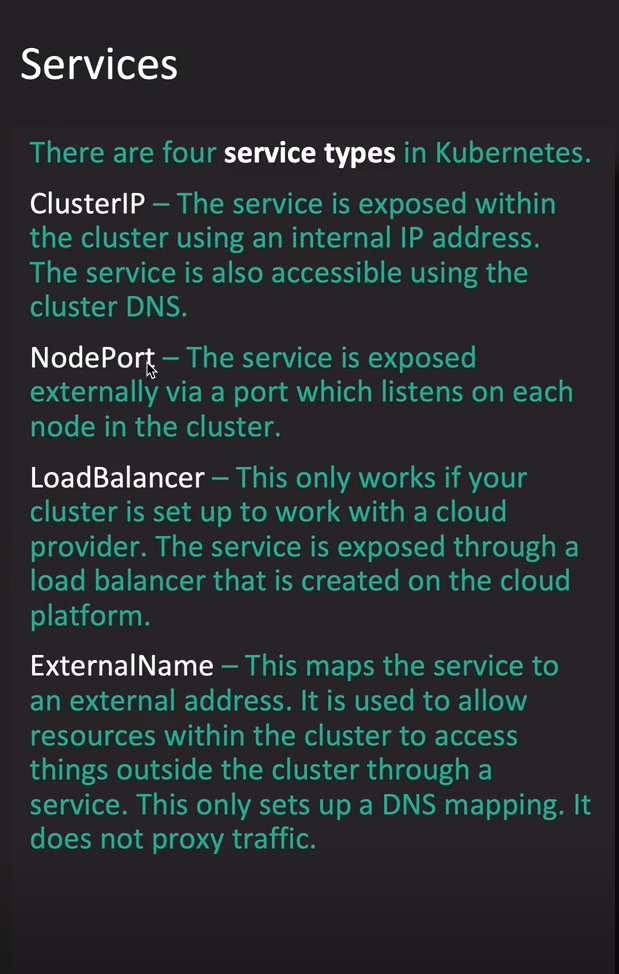
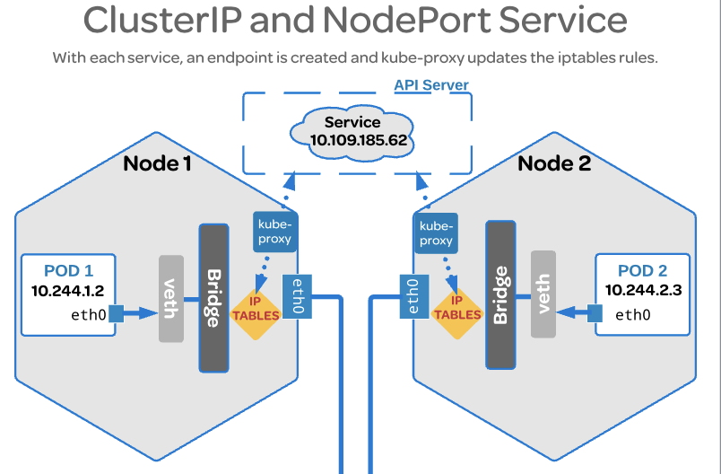
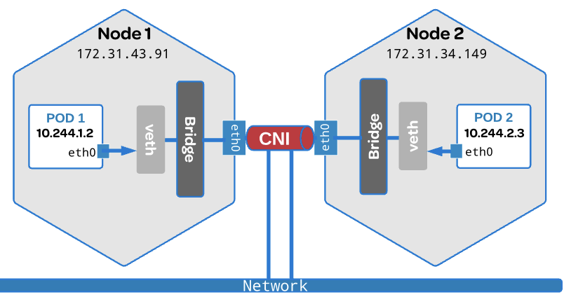

Table of Contents
==================

# Chapter 4: Networking (11%)
   * [Node Networking Concepts](#node-networking-concepts) 
   * [Pod Networking Concepts](#pod-networking-concepts) 
   * [Service Networking Concepts](#service-networking-concepts) 
   * [Container Network Interface](#container-network-interface-cni) 
   * [Load Balancer Configure and Deploy](#load-balancer-configure-and-deploy) 
   * [Ingress Rules Configure](#ingress-rules-configure) 
   * [Cluster DNS Configure](#cluster-dns-configure) 

## Networking
   ### Network Pre-requisite
   
   #### Command References
   ```bash
    -- Manage and display the state of all network
    $ ip link
    $ ip link set em1 down
    $ ip link set em1 mtu 9000
    $ ip link add veth-red type veth peer name veth-bridge

    -- Display IP Addresses and property information
    $ ip addr
    $ ip addr add 192.168.1.1/24 dev em1

    -- Display and alter the routing table
    $ ip route

    -- see all interface in a network
    $ ip arp

    -- Manage network namespace
    $ ip netns
    $ ip netns add blue
    $ ip netns exec red blue
   ``` 

   #### References and Further Study
   * [IP Command](https://access.redhat.com/sites/default/files/attachments/rh_ip_command_cheatsheet_1214_jcs_print.pdf)
  
   
   
   #### Network Namespace
   
   Create network namespaces  
   1. Create Network Namespace  
   ```
   -- create two network namespace red and blue
   $ ip netns add red
   $ ip netns add blue
   ```
   2. Create Bridge Network/Interface  
   ```
   -- create bridge network
   $ ip link add v-net-0 type bridge
   ```
   3. Create VETH Pairs (Pipe/Virtual Cable)  
   ```
   -- create ip network cable
   $ ip link add veth-red type veth peer name veth-red-br
   $ ip link add veth-blue type veth peer name veth-blue-br
   ```
   4. Attach vEth to Namespace  
   ```
   -- attach blue and red cable with namespace
   $ ip link set veth-red netns red
   $ ip link set veth-blue netns blue
   ```

   5. Attach Other vEth to Bridge  
   ```
   -- attach cable with bridge
   $ ip link set veth-red-br master v-net-0
   $ ip link set veth-blue-br master v-net-0
   ```

   6. Assign IP Address  
   ```
   -- set ip address with blue and red namepsace
   $ ip -n red addr add 192.168.15.1 dev veth-red
   $ ip -n blue addr add 192.168.15.2 dev veth-blue
   ```

   7. Bring the Interface UP  
   ```
   -- bring namespce and bridge network up
   $ ip -n red link set veth-red up
   $ ip -n blue link set veth-blue up
   $ ip link set dev v-net-0 up
   ```
   8. Enable NAT-IP Masquerade  
   ```
   -- enable nat-ip masquerade
   $ iptable -t nat -A POSTROUTING -s 192.168.15.0/24 -j MASQUERADE
   ```
   
   
   ### Node Networking Concepts
   For node networking  
   * Each node must have a Interface
   * Each node must have a MAC Address  
   
   #### Ports
   
   | Name                    | Ports       |
   |------------------------ | ----------- |
   | kube-apiserver          | 6443        |
   | kube-scheduler          | 10251       |
   | kube-controller-manager | 10252       |
   | etcd                    | 2379,2380   |
   | kubelet                 | 10250       |
   | worker-node             | 30000-32767 |
   
   
   #### References and Further Study
   * https://kubernetes.io/docs/concepts/cluster-administration/networking/
   
   ### Pod Networking Concepts
   Pod Networking Model
   * Every POD should have an IP address
   * Every POD should be able to communicate with every other POD in the same node.
   * Every POD should be able to communicate with every other POD on other nodes without NAT.
   

   #### References and Further Study
   * https://kubernetes.io/docs/concepts/cluster-administration/networking/
   
   ### Service Networking Concepts
   
   To make a POD accessible create a service for that POD. Service is actually create a forwarding rule in each node  
   
   | IP Address     | Forward To    |
   | -------------  | ------------- |
   | 192.168.13.178 | 10.244.1.2    |
   
   
   
   
   
   * ClusterIP:  
   To make a POD accessible for all POD within the cluster create a service with type clusterIP.
   Create a ClusterIP from a file ```cluster-ip.yaml```   

   ```
    apiVersion: v1
    kind: Service
    metadata:
      name: my-service
    spec:
      type: ClusterIP
      selector:
        app: MyApp
      ports:
        - protocol: TCP
          port: 80
          targetPort: 9376
   ```

   ```
   -- create a service from a yaml defination file
   $ kubectl create -f cluster-ip.yaml

   -- create clusterip for a pod nginx
   $ kubectl expose pod nginx --name nginx-service --type=ClusterIP --port=80 --target-port=80 --protocol=TCP 
   ```

   * NodePort:  
   When a POD is needed to access by outside of the cluster then it's called nodePort.  
   Create a NodePort from a file ```nodeport-ip.yaml```   

   ```
    apiVersion: v1
    kind: Service
    metadata:
      name: my-nodeport
    spec:
      type: NodePort
      selector:
        app: MyApp
      ports:
        - protocol: TCP
          port: 80
          targetPort: 9376
          nodePort: 32212
   ```

   ```
   -- create a service from a yaml defination file
   $ kubectl create -f nodeport-ip.yaml

   -- create clusterip for a pod nginx
   $ kubectl expose pod nginx --name nginx-service --type=NodePort --port=80 --target-port=80 --protocol=TCP 
   ```

   * LoadBalancer:  
   When a POD is needed to access by outside of the cluster then it's called nodePort.
   
   #### Marjor Terms:  
   * Kube-proxy
   * iptables
   * ipvs
   
   #### Command References
   ```
   -- view iptable rules
   $ sudo iptables-save | grep KUBE | grep nginx

   -- get iptables rules created by a service named db-service
   $ iptables -L -t net | grep db-service

   -- get details of kube-proxy in logs
   $ cat /var/log/kube-proxy.log
   ``` 

   #### Tips
   * With each service, a endpoint is created if define a selector in each service.
   * If selector not define in service then create a endpoint manually.
   * When a service created kube-proxy updates the iptables rules. See below image.
  
   <p align="center"></p>
   
   #### References and Further Study
   * https://kubernetes.io/docs/concepts/services-networking/service/
   * https://kubernetes.io/docs/concepts/services-networking/service/#publishing-services-service-types
   
   
   ### Container Network Interface (CNI)
   A CNI goes on top of existing network and allowing to build a tunnel between nodes.
   
   <p align="center"></p>
   
   #### References and Further Study
   * https://kubernetes.io/docs/concepts/extend-kubernetes/compute-storage-net/network-plugins/
   
   ### Load Balancer Configure and Deploy
   #### Command References
   ```bash
    
   ``` 

   #### References and Further Study
   
   
   ### Ingress Rules Configure
   Ingress is a layer 7 load balancer built-in with kubernetes which implement SSL.
   Ingress need services to communicate with outer world.  
   
   Two major component in Ingress  
   ```
   1. Ingress Controller
   2. Ingress Resources   
   ```

   #### Ingress Controller
   Ingress Controller is a reverse-proxy type software like nginx, haproxy, traefik.
   Ingress Controller is not default in kubernetes. It need to configure manually.  
   supported ingress controller software package are 
   * GCP HTTP(S) Load Balancer (GCE)
   * NGINX
   
   
   Steps for Ingress Controller :  
   * Create ingress controller deployment  
   Ingress Controller is created using deployment in kubernetes like other resources.
   ```
   apiVersion: apps/v1
   kind: Deployment
   metadata:
      name: nginx-ingress-controller
      labels:
        app: nginx
   spec:
      replicas: 1
      selector:
        matchLabels:
          app: nginx-ingress
      template:
        metadata:
          labels:
            app: nginx-ingress
        spec:
          containers:
          - name: nginx-ingress-controller
            image: quay.io/kubernetes-ingress-controller/nginx-ingress-controller:0.21.0
          args:
          - /nginx-ingress-controller
          - --configmap=$(POD_NAMESPACE)/nginx-configuration
          env:
          - name: POD_NAME
            valueFrom:
               fieldRef:
                  fieldPath: metadata.name

          - name: POD_NAMESPACE
            valueFrom:
               fieldRef:
                  fieldPath: metadata.namespaces

          ports:
            - name: http
              containerPort: 80
            - name: https
              containerPort: 443
  ```
   * Create a configMap object for nginx configuration value.
   ```
   apiVersion: v1
   kind: ConfigMap
   metadata:
      name: nginx-configuration
   ```
   * Create a service for exposing ingress controller to receive traffic.
   ```
   apiVersion: v1
   kind: Service
   metadata:
      name: my-service
   spec:
      type: NodePort
      selector:
        app: nginx-ingress-controller
      ports:
        - name: http
          protocol: TCP
          port: 443
          targetPort: 9376
        - name: https
          protocol: TCP
          port: 443
          targetPort: 9376
   ```
   
   * Create an Service Account with proper auth permission and role binding.
   ```
   apiVersion: v1
   kind: ServiceAccount
   metadata:
      name: nginx-ingress-serviceaccount
   ```
   * Create an Auth Object.
   
   #### Ingress Resources
   Ingress resource is set of rules which direct traffic to appropriate url direction.
   Ingress resources are created using kubernetes definition file.
   Ingress Resource creates in kubernetes definition file ```ingress-wear.yaml```.
   Traffic goes based on 
   ```
   1. Route
   2. Domain Name
   ```

   Ingress Resource Rules:
   
   #### Command References
   ```bash
    -- create ingress resource rules
    $ 
   ``` 

   #### References and Further Study
   * https://kubernetes.io/docs/concepts/services-networking/ingress/
   
   ### Cluster DNS Configure
   Fully qualified domain name
   
   |    Hostname   |   Namespace   |     Type      |      Root     | IP Address
   | ------------- | ------------- | ------------- | ------------- | ------------- |
   | web-service   |   apps        |    svc        | cluster.local | 10.10.56.20   |
   | 10-12-30-20   |   apps        |    pod        | cluster.local | 10.12.30.20   |
   
   #### Command References
   ```bash
   -- view CoreDNS pods
   $ kubectl get pods -n kube-system

   -- view CoreDNS deployments
   $ kubectl get deploy -n kube-system

   -- view CoreDNS services
   $ kubectl get services -n kube-system

   -- view pod's resolv.conf file
   $ kubectl exec -it nginx -- cat /etc/resolv.conf

   -- look up the kubernetes serviceDNS
   $ kubectl exec -it nginx -- nslookup kubernetes

   -- look up the kubernetes pod DNS
   $ kubectl exec -it busybox --nslookup 10-244--1-2.default.pod.cluster.local

   -- get the logs for CoreDNS errors
   $ kubectl logs [core_dns_pods]
   ``` 

   #### References and Further Study
   * https://kubernetes.io/blog/2018/07/10/coredns-ga-for-kubernetes-cluster-dns/
   * https://kubernetes.io/docs/tasks/administer-cluster/dns-custom-nameservers/
   
[<- Back to Table of Contents](../README.md)