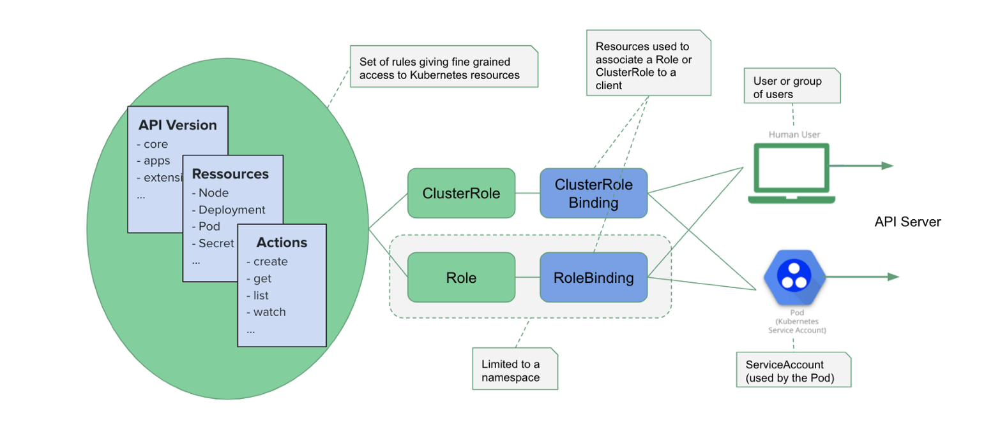

Table of Contents
==================

# Chapter 8: Security (12%)
   * [Security Primitives](#security-primitives)
   * [Configure Authentication and Authorization](#configure-authenticatation-and-authorization)
   * [Configure Network Policies](#configure-network-policies)
   * [Manage TLS Certificate for Cluster](#manage-tls-certificate-for-cluster)
   * [Image Security](#image-security)
   * [Persistent Key Value Stores](#persistent-key-value-stores)

## Security
   ### Security Primitives
   Object are important in security primitives
   
   
   * ServiceAccounts  
   A ServiceAccount is a kubernetes object which used by other processes, services or application when try to access to the cluster or communicate with the api-server.
   Example: Try to access api-server from a container within a pod.    
   
   When a serviceAccount creates following task happens
   1. Creates a serviceaccount object.
   2. Creates a token for the serviceaccount
   3. Creates a secret object and stores that token inside secret object and also token will linked to serviceaccount.
   ```
   -- create serviceaccount
   $ kubectl create sa demo-sa

   -- get details of serviceaccount
   $ kubectl describe sa demo-sa

   -- get token details in secret
   $ kubectl describe secret demo-sa-token
   ```
   Tips:  
   Every namespaces has a default servicesaccount. When a pod try to communicate with the api-server, pod uses this serviceaccounts secret token.
   
   * API Groups
   There are 2 types of API Group
   1. Core
        1. api (api groups)
            * v1 (resources version)
                * pod (verbs: list,create,edit etc)
                * node (verbs: list,create,edit etc)
   2. Named 
        * apis (api groups)
            * v1 (resources version)
                * deployments (verbs: list,create,edit etc)
                * replicasets (verbs: list,create,edit etc)
                * statefullset (verbs: list,create,edit etc)
        * extensions
        * networking.k8.io
        * storage.k8.io
        * authentication.k8.io
        * certificates.k8.io
   
   * Role
   Resource Base Access Control (RBAC)   
   jane-role.yaml
   ```
    apiVersion: rbac.authorization.k8s.io/v1beta1
    kind: Role
    metadata:
     name: list-pods
     namespace: default
    rules:
     — apiGroups:
       — ''
     resources:
       — pods
     verbs:
       — list   
   ```
   ```
   -- create a roles using a jane-role.yaml file
   $ kubectl create -f jane-role.yaml

   -- get roles
   $ kubectl get roles
   ```
   * RoleBindings
   RoleBindings Binds Role with specific users account
   ```jane-role-binding.yaml```
   ```
   apiVersion: rbac.authorization.k8s.io/v1beta1
   kind: RoleBinding
   metadata:
     name: list-pods_demo-sa
     namespace: default
   roleRef:
     kind: Role
     name: list-pods
     apiGroup: rbac.authorization.k8s.io
   subjects:
     — kind: ServiceAccount
       name: demo-sa
       namespace: default
   ```
   ```
    -- create role bindings jane-role-binding.yaml
    $ kubectl create -f jane-role-binding.yaml
    
    -- get all rolebindings
    $ kubectl get rolebindings
   ```

   **Check Access Permission**  
   ```
   --  check permission for create a deployment
   $ kubectl auth can-i create deployments

   --  check permission for delete a node
   $ kubectl auth can-i delete nodes

   --  check permission for create a deployment for another user like dev-user
   $ kubectl auth can-i create deployments --as dev-user

   --  check permission for delete a node for another user like dev-user
   $ kubectl auth can-i delete nodes     --as dev-user

   ```
   * ClusterRole
   Cluster role is almost identical to Role except it's working on cluster scope.   
   There are two scoped properties in Kubernetes
   1. Namespaces Scoped: Resources which tightly bind with namespace. 
        * POD
        * ReplicaSet
        * Many more
   2. Cluster Scoped: Resources which is not bind with namespace.
        * Nodes
        * PersistentVolume
        * ClusterRoles
        * ClusterRoleBindings
        * CertificateSigningRequests
        * Namespaces
   ```
   -- get namespaced resources
   $ kubectl api-resources --namespaced=true

   -- get cluster scoped resources
   $ kubectl api-resources --namespaced=false
  ```
   Resource Base Access Control (RBAC)   
   jane-cluster-role.yaml
   ```
    apiVersion: rbac.authorization.k8s.io/v1beta1
    kind: ClusterRole
    metadata:
     name: list-pods
     namespace: default
    rules:
     — apiGroups:
       — ''
     resources:
       — pods
     verbs:
       — list   
   ```
   ```
   -- create a roles using a jane-cluster-role.yaml file
   $ kubectl create -f jane-cluster-role.yaml

   -- get roles
   $ kubectl get clusterroles
   ```

   * ClusterRoleBindings
   ClusterRoleBindings Binds Role with specific users account
   ```jane-cluster-role-binding.yaml```
   ```
   apiVersion: rbac.authorization.k8s.io/v1beta1
   kind: ClusterRoleBinding
   metadata:
     name: list-pods_demo-sa
     namespace: default
   roleRef:
     kind: Role
     name: list-pods
     apiGroup: rbac.authorization.k8s.io
   subjects:
     — kind: ServiceAccount
       name: demo-sa
       namespace: default
   ```
   ```
    -- create cluster role bindings jane-cluster-role-binding.yaml
    $ kubectl create -f jane-role-binding.yaml
    
    -- get all clusterrolebindings
    $ kubectl get clusterrolebindings
   ```
   
   #### Command References
   ```bash
   -- crate serviceaccount named as jenkins
   $ kubectl create sa jenkins

   -- view config using by kubectl
   $ kubectl config view

   -- set new credentials for cluster
   $ kubectl config set-credentials chad --username=chad --password=password

   -- create a new cluster role bindings for anonymous users
   $ kubectl create clusterrolebindings cluster-system-anonymous --cluster-role=cluster-admin --user=system:anonymous

   -- set the new cluster info for remote workstation
   $ kubectl config set-credentials kubernetes --server=https://172.31.41.61:6443 --certificate-authority=ca.crt --embed-cert=true

   -- use configured context
   $ kubectl config use-context kubernetes
   ``` 

   #### References and Further Study
   * https://medium.com/better-programming/k8s-tips-using-a-serviceaccount-801c433d0023
   * https://thenewstack.io/kubernetes-access-control-exploring-service-accounts/
   * [Imperative Command](#kubernetes-imperative-commands)
   
   ### Configure Authentication and Authorization
   There are two types of account interact with kubernetes cluster.
   * Users Account (Admin/Developer)
   * ServiceAccounts (Bots)
   
   #### Authentication
   When a user try to accesses the cluster. It need to first access in kube-apiserver. Kube-apiserver authenticate a user by 
   * Static Password File 
   Add a csv file with columns like username, password, groups. Not recommended ways.
   ```
   -- add user-details.csv in api-server.yaml or api-server.service
   - --basic-auth-file=user-details.csv

   --verify user
   $ curl -v -k https://master-node-ip:6443/api/v1/pods -u "user1:password123"
   ```
   * Static Token File
   Same as Static Password file except password replace by a token. Not recommended ways.
   ```
   -- add user-token-details.csv in api-server.yaml or api-server.service
   - --token-auth-file=user-token-details.csv

   --verify user
   $ curl -v -k https://master-node-ip:6443/api/v1/pods --header "Authorization: Bearer <base64 token>"
   ```
   
   * Certificates
   Kubernetes has a builtin certificate signing API which automatically creates certificate for users. 
   **Steps**
   1. Create CertificateSigningRequest Object.
   2. Review Requests
   3. Approve Requests
   3. Share Certs to Users
   
   ```
   -- 1. create a jane.key for a user name jane
   $ openssl genrsa -out jane.key 2048 

   -- 2. send requst to administrator using a generated csr
   $ openssl req -new -key jane.key -subj "/CN=jane" -out jane.csr

   -- create CertificateSigningRequest object using csr. encode jane.csr using base64 first.
   apiVersion: certificates.k8s.io/v1beta1
   kind: CertificateSigningRequest
   metadata:
    name: jane
   spec:
    groups:
    - system:authenticated
    usages:
    - digital signature
    - key encipherment
    - server auth
    request: LS0tLS1CRUdJTiBDRVJUSUZJQ0FURSBSRVFVRVNULS0tLS0KTUlJQ2VUQ0NBV0VDQVFBd0ZqRVVNQklHQTFVRUF4TUxhblZoYmk1bGJtTnBjMjh3Z2dFaU1BMEdDU3FHU0liMwpEUUVCQVFVQUE0SUJEd0F3Z2dFS0FvSUJBUUNXamNRdDA5WWdIbTVjaER1N2JmVFBUMyttWTZ2bkRSN1ZFTm9tCmpNWkNCVkprRVl1OGt6ZWRqZldiNHdHUXNnZG9YMWxkbGZ0UERRV2xKTHhRanVScURCVjVtZkJ3bnpBamljM2QKQTFlcC9GeHV5YTRFVmRyK0kyWEJ3cGhWRlY0cXFTR0NNWjNIK0FDRFhCaWxkR1p2UTBqMFVlYThMcUJNWExkMAp2dWJWemt6YndCZmJQOFpuSHVqVVdWVjl0bmsxMnpHRXRXOFl3VkZ5SzdzUzdOK3J2RjJpR2FqOUhFTXJoNXRoCk1vVzBzMFdhZEhxWVlIUDF2TDN1b2hRZGRScWxtUFFrRTNLdkN4ZlJPTXBUeVVIL1BpMGVGRGMzekZwVWpwTFIKM3k0T3RIS2w3SG1XM3E4RDdENlVpNEp5OUNjRmUreFNHSlkyejZtajN2Q3I2amMxQWdNQkFBR2dIakFjQmdrcQpoa2lHOXcwQkNRNHhEekFOTUFzR0ExVWRFUVFFTUFLQ0FEQU5CZ2txaGtpRzl3MEJBUXNGQUFPQ0FRRUFBOEdXCnprTTg3a3lYTHdLcTlkcTdFOWNMTUh1SmoyelJKQnNCNzJnd1NvNVVDS1VjYWowblhEMVdKQXhXcllHZVB1SVUKemdqTFpsc1VNWGJ1SEtJTENqaUY1Q0JZVUtPTFdTRmNqNUlreU1hTU9ZdmQ0eHBYdkNOTzRVbWlxSktUYXZiMQplWG9ZZGQ0NzQxRW5qNG5vV0tveDNsSVVQM1VjcVhBa05sZDJaNHpDK2Zqbk9uSWFuaUQ3c0xJWXFIOG9WSXZNClA3dnRjUjJZVUp2bzlzVUdBOEdyYkhJWUFRVmlycTZ1ZkdpNUttb29VQ2hHbmtmQkJ2LytpZ1VlRlowTjkrT0MKNzFTSllMQjFGM3d2eDdvS25XN2pKdU1SdTkvNmJMUzRKK1ZjNTJsRk9YUWhjc29jYVdmU3lUbVJETDAvejcwNAoxcllhMFNMTldaN3pSbU5Hcnc9PQotLS0tLUVORCBDRVJUSUZJQ0FURSBSRVFVRVNULS0tLS0K
   
   -- get all csr
   $ kubectl get csr

   -- approve request 
   $ kubectl certificate approve jane

   -- get certificate and decode it using base64 ans share it with user.
   $ kubectl get csr jane -o yaml
  ```
   
   * Identity Services (LDAP, etc)
   Identity services is not included in here.
   
   #### References and Further Study
   * https://kubernetes.io/docs/reference/access-authn-authz/certificate-signing-requests/
   
   ### Configure Network Policies
   Network policy is a unique resources in kubernetes which defines traffic flow to pod.   
   There are two types of traffic in a pod
   1. Ingress Traffic: Comes inside from other resources
   2. Egress Traffic: Goes outside to other resources 
   
   All CNI plugins does not support network policies. Some of the supported CNI are
   1. kube-router
   2. Calico
   3. Romana
   4. weave-net
   
   For network policy, use pod selector like services, deployments, replicaset.
   NetworkPolicy definition file
   
   ```
   apiVersion: networking.k8s.io/v1
   kind: NetworkPolicy
   metadata:
     name: test-network-policy
     namespace: default
   spec:
     podSelector:
       matchLabels:
         role: db
      policyTypes:
      - Ingress
      - Egress
   ingress:
      - from:
        - ipBlock:
            cidr: 172.17.0.0/16
            except:
            - 172.17.1.0/24
        - namespaceSelector:
            matchLabels:
              project: myproject
        - podSelector:
            matchLabels:
              role: frontend
        ports:
        - protocol: TCP
          port: 6379
   egress:
      - to:
        - ipBlock:
            cidr: 10.0.0.0/24
        ports:
        - protocol: TCP
          port: 5978
   ```
   
   #### Command References
   ```bash
   -- create newtowk policy
   $ kubectl create -f network-policy.yaml
   
   -- list network policy
   $ kubectl get networkpolicy
   ``` 

   #### References and Further Study
   * https://kubernetes.io/docs/concepts/services-networking/network-policies/
   
   ### Manage TLS Certificate for Cluster
   #### Command References
   ```bash
   ``` 

   #### References and Further Study
   * 
   
   ### Image Security
   Image path defines in pod or deployment mainly a short form of images
   Fully qualified image path looks like  
   ```image: docker.io/nginx/nginx```
   
   If we breakdown this image we will find out  
   
   |docker.io  |    nginx     |        nginx     |
   |-----------|--------------|----------------- |
   | Repository| User Account | Image Repository |
   
   #### Private Repository
   To set a private repository image as a container image, following steps need to follow
   1. Create a secret for the image.
   2. Configure in POD
   
   * Create a secret   
   Create a secret for the image using imperative way
   ```
   -- create image
   $ kubectl create secret docker-registry acr --docker-server=https://podofminerva.acr.io --docker-username=username --docker-password=uiwuwXd23 --docker-email=demo@gmail.com
   ```

   * Configure in POD
   ```
   -- add new attribute
   imagePullSecret:
   - name: acr
   ``` 

   #### Command References
   ```bash
   -- login to docker
   $ docker login private-registry.io
   ``` 

   #### References and Further Study
   * https://kubernetes.io/docs/concepts/containers/images/
   
   ### Security Contexts
   A security context defines the operating system security settings (uid, gid, capabilities, SELinux role, etc..) applied to a container.
   
   ```
    apiVersion: v1
    kind: Pod
    metadata:
      name: security-context-demo
    spec:
      securityContext:
        runAsUser: 1000
        runAsGroup: 3000
        fsGroup: 2000
      volumes:
      - name: sec-ctx-vol
        emptyDir: {}
      containers:
      - name: sec-ctx-demo
        image: busybox
        command: [ "sh", "-c", "sleep 1h" ]
        volumeMounts:
        - name: sec-ctx-vol
          mountPath: /data/demo
        securityContext:
          capabilities:
            add: ["NET_ADMIN", "SYS_TIME"]
   ```
   #### Command References
   ```bash
   -- list security context
   $ kubectl get securitycontext
   ``` 

   #### References and Further Study
   * https://kubernetes.io/docs/tasks/configure-pod-container/security-context/
   * https://unofficial-kubernetes.readthedocs.io/en/latest/concepts/policy/security-context/
   
   ### Persistent Key Value Stores
   For persistent key value stores see section [Installation](#chapter-2-install-config-and-validate-12) 

[<- Back to Table of Contents](../README.md)